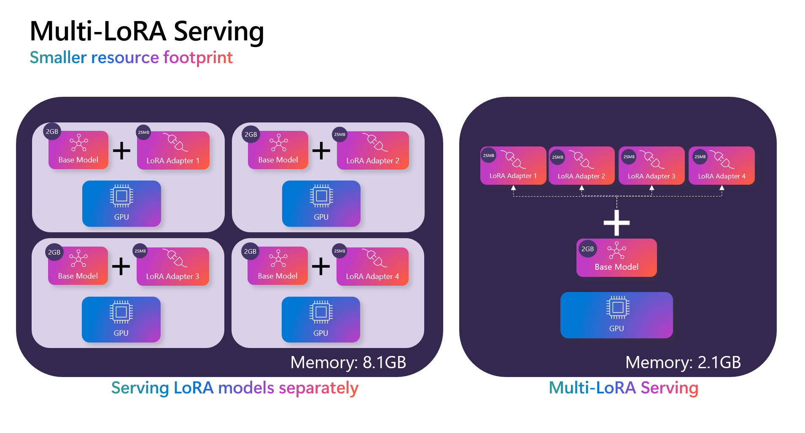

# Finetune

The `olive finetune` command will finetune a PyTorch/Hugging Face model and output a Hugging Face PEFT adapter. If you want to convert the PEFT adapter into a format for the ONNX Runtime, you can execute the `olive generate-adapter` command after finetuning.

## :material-clock-fast: Quickstart

The following example shows how to finetune [Llama-3.2-1B-Instruct from Hugging Face](https://huggingface.co/meta-llama/Llama-3.2-1B-Instruct/tree/main) either using your local computer (if you have a GPU device) or using remote compute via Azure AI integration with Olive.

=== "Local"

    !!! info
        You'll need a GPU device on your local machine to fine-tune a model. 

    ```bash
    olive finetune \ 
        --model_name_or_path meta-llama/Llama-3.2-1B-Instruct \ 
        --trust_remote_code \ 
        --output_path finetuned-model \ 
        --data_name xxyyzzz/phrase_classification \ 
        --text_template "<|start_header_id|>user<|end_header_id|>\n{phrase}<|eot_id|><|start_header_id|>assistant<|end_header_id|>\n{tone}" \ 
        --method qlora \ 
        --max_steps 30 \ 
        --log_level 1 \ 
    ```

=== "Azure AI"

    You can fine-tune on remote Azure ML compute by updating the placeholders (`{}`) in the following code snippet with your workspace, resource group and compute name details. Read the [How to create a compute cluster](https://learn.microsoft.com/en-us/azure/machine-learning/how-to-create-attach-compute-cluster?view=azureml-api-2&tabs=azure-studio) article for more details on setting up a GPU cluster in Azure ML.

    ```bash
    olive finetune \ 
        --model_name_or_path azureml://registries/azureml-meta/models/Llama-3.2-1B/versions/2 \  # (1)!
        --trust_remote_code \ 
        --output_path finetuned-model \ 
        --data_name xxyyzzz/phrase_classification \ 
        --text_template "<|start_header_id|>user<|end_header_id|>\n{phrase}<|eot_id|><|start_header_id|>assistant<|end_header_id|>\n{tone}" \ 
        --method qlora \ 
        --max_steps 30 \ 
        --log_level 1 \ 
        --resource_group {RESOURCE_GROUP_NAME} \ 
        --workspace_name {WORKSPACE_NAME} \ 
        --aml_compute {COMPUTE_NAME}
    ```
    
    1. Note that the model path is pointing to an Azure ML registry.

    You can download the model artefact using the Azure ML CLI:

    ```bash
    az ml job download --name {JOB_ID} --resource-group {RESOURCE_GROUP_NAME} --workspace-name {WORKSPACE_NAME} -all
    ```

### :octicons-plug-16: Generate the adapters for ONNX Runtime

If you would like your fine-tuned model to run on the ONNX Runtime, you'll need to execute the `olive generate-adapter` command, using

```bash
olive generate-adapter \ 
    --model_name_or_path finetuned-model/model \ 
    --adapter_path finetuned-model/adapter \ 
    --use_ort_genai \ 
    --output_path adapter-onnx \ 
    --log_level 1
```

Once the `olive generate-adapter` has successfully completed, you'll have:

1. The base model in an optimized ONNX format.
2. The adapter weights in a format for ONNX Runtime.

OLIVE and the ONNX runtime support the *multi-LoRA* model serving pattern, which greatly reduces the compute footprint of serving many adapters:

<figure markdown="span">
  { width="700" }
  <figcaption>Multi-LoRA serving versus single-LoRA serving</figcaption>
</figure>

You can use the `olive finetune` command for each adapter and then convert them using `olive generate-adapter` (updating the `--adapter_path` for each). In the [Inference model using ONNX runtime](#simple-onnx-inference-model-using-onnx-runtime) section, we show you how to load many adapters.

### :simple-onnx: Inference model using ONNX Runtime

=== "Python"

    Copy-and-paste the code below into a new Python file called `app.py`:

    ```python
    import onnxruntime_genai as og
    import numpy as np
    import os

    model_folder = "adapter-onnx/model"

    # Load the base model and tokenizer
    model = og.Model(model_folder)
    tokenizer = og.Tokenizer(model)
    tokenizer_stream = tokenizer.create_stream()

    # Load the LoRA adapter weights
    weights_file = os.path.join(model_folder, "adapter_weights.npz")
    adapter_weights = np.load(weights_file)

    # Set the max length to something sensible by default,
    # since otherwise it will be set to the entire context length
    search_options = {}
    search_options['max_length'] = 200
    search_options['past_present_share_buffer'] = False

    chat_template = "<|start_header_id|>user<|end_header_id|>\n{input}<|eot_id|><|start_header_id|>assistant<|end_header_id|>\n"

    text = input("Enter phrase: ")

    # Keep asking for input phrases
    while text != "exit":
    if not text:
        print("Error, input cannot be empty")
        exit

    # generate prompt (prompt template + input)
    prompt = f'{chat_template.format(input=text)}'

    # encode the prompt using the tokenizer
    input_tokens = tokenizer.encode(prompt)

    # the adapter weights are added to the model at inference time. This means you
    # can select different adapters for different tasks i.e. multi-LoRA.

    params = og.GeneratorParams(model)
    for key in adapter_weights.keys():
        params.set_model_input(key, adapter_weights[key])
    params.set_search_options(**search_options)
    params.input_ids = input_tokens
    generator = og.Generator(model, params)

    print("Output: ", end='', flush=True)
    # stream the output
    try:
        while not generator.is_done():
        generator.compute_logits()
        generator.generate_next_token()

        new_token = generator.get_next_tokens()[0]
        print(tokenizer_stream.decode(new_token), end='', flush=True)
    except KeyboardInterrupt:
        print("  --control+c pressed, aborting generation--")

    print()
    text = input("Input: ")

    ```

    Run the code with:

    ```bash
    python app.py
    ```

## :fontawesome-solid-signs-post: Next steps

<!-- [:octicons-arrow-right-24: Tutorials](../tutorials/index.md) -->

[:octicons-arrow-right-24: Feature How-tos](../how-to/index.md)

