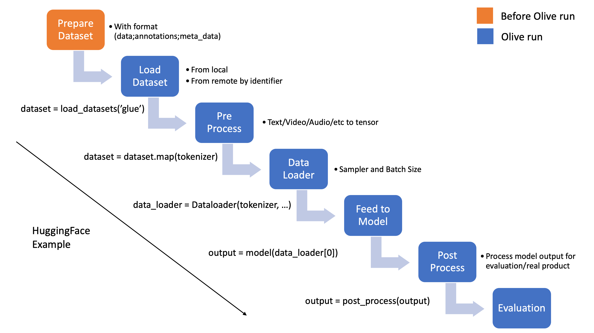
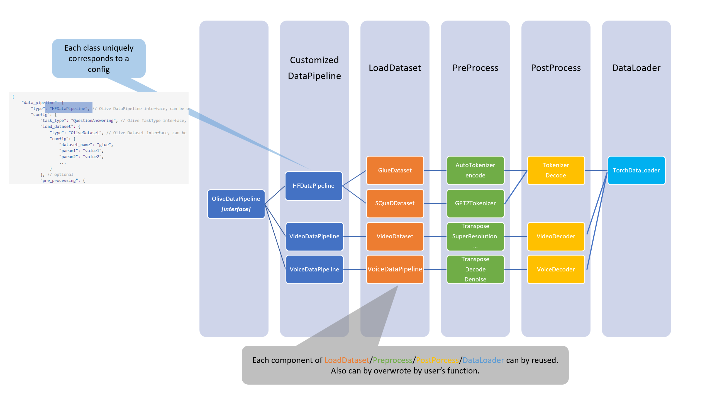

# Olive Design Documentation

## Overview
This document describes the Olive components, and some implementation details. The components covered are:
- [Pass](#pass)
    - [Base Class](#base-class)
    - [default_config](#default_config)
    - [run](#run)
    - [Implemented Passes](#implemented-passes)
- [Engine](#engine)
    - [run](#run-1)
    - [cache](#cache)
- [Search](#search)
    - [Search Parameter](#searchparameter)
    - [Search Space](#searchspace)
    - [Search Algorithm](#searchalgorithm)
    - [Search Results](#searchresults)
- [Search Strategy](#search-strategy)
    - [Execution order](#execution-order)
    - [User Interface](#user-interface)
    - [Implementation](#implementation)
- [System](#system)
    - [OliveSystem Class](#olivesystem-class)
- [Data Container](#data-container)
    - [General workflow for dataset load and processing](#general-workflow-for-dataset-load-and-processing)
    - [Olive DataContainer interface](#olive-datacontainer-interface)
    - [Relationship between DataContainer and DataComponent](#relationship-between-datacontainer-and-datacomponent)
- [olive.workflows.run](#oliveolive)
    - [User Interface](#user-interface-1)

## Pass
Passes are the building blocks of an Olive workflow. Olive uses multiple Passes to process an input model.

### Base Class
The base class for Pass:
```python
class Pass(ABC):
    def __init__(self, accelerator_spec: AcceleratorSpec, config: Union[Dict[str, Any], BaseModel], disable_search: Optional[bool] = False, host_device: Optional[str] = None):
        ...

    @classmethod
    def get_config_class(cls, disable_search: Optional[bool] = False) -> Type[BaseModel]:
        ...

    @classmethod
    @abstractmethod
    def default_config(cls, accelerator_spec: AcceleratorSpec) -> Dict[str, PassConfigParam]:
```
where `BaseModel` is a [pydantic model](https://docs.pydantic.dev/usage/models/)

It is initialized using:
- Config dictionary `{“param_name”: param_value}` and boolean `disable_search`.

  If `disable_search=False`, use default search parameters, if any, for parameters that are not specified
        in the config. Else use the default value.
- Pydantic model which behaves like a Dataclass with type validation. Each pass class has a class method `get_config_class` which returns the pass specific pydantic model that users can instantiate.

Optional parameters can be fixed values or search values which are prescribed using `SearchParameter`.

Searchable parameters have default search values which can be used by assigning the config value as `SEARCHABLE_VALUES`. Optional parameters use the default fixed value, also assignable using `DEFAULT_VALUE`, if not assigned.

During initialization, the pass compares the user provided config and pass config class to create a dictionary for fixed parameters (`_fixed_params`) and search parameters (`search_space`).

### default_config
Each pass must implement the default_config static method. It returns a dictionary
```python
{“param_name”: PassConfigParam}
```

`PassConfigParam` is a dataclass which describes whether the parameter is required and holds its default fixed value and search values.

**Note:**
- To support hashing, the parameter values must be jasonify-able. So, they can only be string, int, float, tuple, bool, list, dict, or None.
- We will add support for other python objects and callable in the future for local use.

### run
To run a pass, the search parameters need to be assigned a value each from their search options (support). We call this a `search_point`.

The pass then combines those with the fixed parameters to form a complete configuration using `config_at_search_point`. This run configuration is also used by the engine as a unique id to cache the pass run.

### Implemented Passes
- OnnxConversion
- OnnxOpVersionConversion
- OrtTransformersOptimization
- OnnxDynamicQuantization
- OnnxStaticQuantization
- OnnxQuantization
- IncStaticQuantization
- IncDynamicQuantization
- IncQuantization

## Engine
The engine is responsible for
- Managing and executing the passes
- Manage input, output and intermediate models
- Evaluating intermediate or final output models as needed

The user configures the engine using a configuration dictionary that also selects the search strategy to use. Passes are then created and registered along with their evaluators if any.

The engine maintains a cache directory to cache pass runs, models and evaluations.

### run
This method runs all the registered passes on the input model and produces one or more candidate models.

The engine delegates the search to the search strategy. It only executes passes and evaluates output models as prescribed by the search strategy. Evaluation results are fed back to the search strategy.

### cache
The engine maintains a cache directory with three sub-directories:
- `model`: stores model files and their corresponding json configs (framework, model path, and other information). Each model created during execution is given a unique model id. The input model is identified by the hash of its model file contents.
- `run`: stores the id of the output model (present in the model cache) for each run of a pass. The cache is indexed by `{pass type}_{hash of pass config}_{input model id}`.
- `evaluation`: stores the evaluation results for models. The cache is indexed by the model id.

## Search
Olive workflows support search parameters which are optimized using search algorithms.

At the most basic level is `SearchParameter` which describes the options for search parameters. `SearchSpace` combines search parameters for one or more passes and `SearchAlgorithm` provides different sampling algorithms to search for the best parameter configuration (search point) from the search space.

### SearchParameter
A search parameter defines a discrete categorical distribution.

There are two types of search parameters:
- `Categorical`: Discrete categorical distribution with uniform weights. `Boolean` is a special case of `Categorical` with support `[True, False]`.
- `Conditional`: Conditional discrete categorical distribution. The parameter has one or more parents from the same pass configuration. Each combination of parent values has an associated Categorical search parameter.

**Note:**
- There cannot be any cyclic parent child dependencies.
- Search algorithms order the search parameters topologically so that the parents are sampled before the children.

### SearchSpace
Search space combines search parameters from one or more passes and provides methods to iterate over the search space (`iterate`) or generate random samples (`random_sample`).

The search parameters are passed to SearchSpace and saved in the format
```python
{“pass_id/space_name”: {“param_name”: SearchParameter}}
```

This hierarchical structure that indexes the search parameter dictionaries by `pass_id` allows us to take advantage of the chronological order of pass execution if wanted.

The corresponding conceptual search space is the space of all possible parameter configurations. Each point in this space is called a `search point`:
```python
{“pass_id/space_name”: {“param_name”: param_value}}
```

### SearchAlgorithm
Search algorithm operates over a search space and provides samples/trials (search points) from the search space to execute and evaluate.

Each search algorithm provides the methods:
- `suggest`: returns a search point to execute and evaluate. The algorithm can sample a search point based on the evaluation results for previously suggested points.
- `report`: report evaluation results for a search point. The search point can also be pruned if it contains invalid pass configs or failed during execution/evaluation.

The following search algorithms have been implemented:
- `ExhaustiveSearchAlgorithm`: Exhaustively iterates over the search space.
- `RandomSearchAlgorithm`: Randomly samples points from the search space without replacement.
- `OptunaSearchAlgorithm`: Abstract base class for algorithms built using `optuna` samplers. This class cannot be used directly
    - `TPESearchAlgorithm`: Uses optuna `TPESampler`.

### SearchResults
`SearchResults` stores evaluation results for samples made from a search space and provides tools to analyze and select the best search point/s.

Results are reported using the `record` method.

Currently `best_search_point` selects the best search point by maximizing/minimizing metrics using tie breaking. We intend to provide different model selection strategies for both single and multi-objective optimization.

## Search Strategy
Search strategy provides an optimization pipeline that finds the best search point from the search space of one or more passes.

It consists of two sub-components – `execution_order` and `search_algorithm`. Search algorithm has been covered in the previous section.

### Execution Order
The execution order defines the order in which the passes are optimized.

Currently, we support two execution orders:
- `joint`: The search spaces of all passes are combined and searched together to find the best search point. Each search point that is evaluated has parameters for the search parameters of all passes.
- `pass-by-pass`: The search space of each pass is searched and optimized independently in order. For instance, for two passes `PassA, PassB` - `PassA` is optimized first, and its best output model is used as the input model for optimizing `PassB`. The final best output model is the best output model of `PassB`. **Note:** This execution order assumes that the intermediate searches produce single best models but we will support multiple best models in the future.

The above execution orders are implemented individually but both are specific instances of an execution order consisting of a chain of groups of passes.
- `joint`: `[PassA, PassB]`
- `pass-by-pass`: `PassA -> PassB`

It is possible to extend this to other instances such as
```
PassA -> [PassB, PassC] -> PassD
```

We intend to generalize the execution order implementation to support such chain.

There are also plans to support nested execution order of forms like `(PassA, [PassB, PassC])` where passes `B` and `C` are optimized for each search point in pass `A`.

### System
System encapsulates the system Olive is targeting as well the system on which Olive is running. A pass can select a system as a 'host' and the evaluator can 'target' a system. The 'host' and 'target' are user provided configuration options. Olive provides AzureMLSystem, DockerSystem, PythonEnvironmentSystem and IsolatedORTSystem in addition to LocalSystem.

### OliveSystem Class
The base class for System:
```python
class OliveSystem(ABC):
    def __init__(self, device: Device):
        ...
    @abstractmethod
    def run_pass(
        self,
        the_pass: Pass,
        model: OliveModelHandler,
        output_model_path: str,
        point: Optional[Dict[str, Any]] = None,
    ) -> OliveModelHandler:
        """
        Run the pass on the model at a specific point in the search space.
        """

    @abstractmethod
    def evaluate_model(self, model: OliveModelHandler, metrics: List[Metric]) -> Dict[str, Any]:
        """
        Evaluate the model
        """
```

The `run_pass` method is responsible to run the input Pass for the given model on this system.

The `evaluate_model` method is responsible to evaluate the model on this system.

### User Interface
The user or engine interacts with the search strategy using the following methods:
- `next_step`: returns the next search point to execute and evaluate, and the if of input model to use.
- `record_feedback_signal`: record the evaluation results for a search point along with ids of models generated during execution.

### Implementation
The current implementation of search strategy is not mature and will be updated in a follow-up PR to generalize the chained execution order.

Currently, it maintains a list of “search spaces groups” which are just groups of search parameter dictionaries from passes that are meant to be optimized together. Joint has one search spaces group while pass-by-pass has a group for each pass.


## Data Container

### General workflow for dataset load and processing
Before introducing the Olive `DataContainer` interface, let's first outline the general workflow for loading and processing datasets in machine learning.


Based on the above workflow, we can see that dataset loading and processing can be divided into two steps:

1. User to prepare the dataset with given format before invoking Olive: `[data, annotation(optional), meta_data(optional)]`.
    - `data`: The input data for the model to process. This can be a single tensor, text, file, or a list of tensors, texts, or files.
    - `annotation`: The label for the data. This can be a single tensor, text, file, or a list of tensors, texts, or files.
    - `meta_data`: The metadata for the data. This includes information that can help with understanding the structure or parsing of the current data.
2. After preparing the data, users can implement their own methods to load the dataset and obtain the dataloader, then invoke Olive to run the pass or evaluation.
The steps would be like:
    - `load_dataset` to load the dataset.
    - `pre_process_data` to format the dataset and make it ready for model to consume. Could be optional if the dataset is ready for model inference. Note that the data after `load_dataset` and `pre_process_data` should be return `(data, label)` with `__getitem__` methods.
    - `post_precess_data` to format the model output to the format which can be used for evaluation. Could be optional.
    - `dataloader` to generate the dataloader with given batch_size/sample_ratio.


Then Olive `DataContainer` interface will be introduced to setup above workflow where Olive can load the dataset and prepare dataloader after data processing which can be invoked by pass or evaluation in a unified way.


### Olive DataContainer interface
Based on above workflow, Olive `DataContainer` provides interface to:
1. unifies the dataset interface for different dataset, models and tasks.
2. enables Olive to provide the built-in `load_dataset`, `pre_process_data` and `post_process_data` and `dataloader`.
3. simplifies the user experience to implement their own `load_dataset`, `pre_process_data` and `post_process_data` and `dataloader`.
4. simplifies the user experience for popular dataset models and tasks.

Then the design for `DataContainer` interface will be like:


1. There will be built-in DataContainers for different datasets, models and tasks, which implement the Olive `DataContainer` interface, like `HuggingfaceDataContainer`.
2. User can use pre-defined register(`Decorator`) to register their own `load_dataset`, `pre_process_data`, `post_process_data` and `dataloader` in `user_scripts`, then replace the built-in default component with their own one. The register usage will be like:
    ```python
    ############################## Decorator ##############################
    @Registry.register_dataset("test_load_dataset")
    def _load_dataset(test_value):
        ...

    @Registry.register_dataloader()
    def _test_dataloader(test_value):
        ...

    @Registry.register_pre_process()
    def _pre_process_data(test_value):
        ...

    @Registry.register_post_process()
    def _post_process_data(test_value):
        ...

    DataConfig(
        load_dataset_config=DataComponentConfig(
            type="test_dataset",
            params={"test_value": "test_value"},
        ),
        dataloader_config=DataComponentConfig(
            type="_test_dataloader",  # This is the key to get dataloader
            params={"test_value": "test_value"},
        ),
    )
    ```

### Relationship between `DataContainer` and `DataComponent`

`DataContainer` is the endpoint used to call the components under `DataComponent`, which will use `DataConfig` to describe the structure which includes `load_dataset`, `pre_process_data`, `post_process_data` and `dataloader`. The relationship between `DataContainer` and `DataComponent` is as follows:
```python
DefaultDataComponentCombos = {
    DataComponentType.LOAD_DATASET.value: DefaultDataComponent.LOAD_DATASET.value,
    DataComponentType.PRE_PROCESS_DATA.value: DefaultDataComponent.PRE_PROCESS_DATA.value,
    DataComponentType.POST_PROCESS_DATA.value: DefaultDataComponent.POST_PROCESS_DATA.value,
    DataComponentType.DATALOADER.value: DefaultDataComponent.DATALOADER.value,
}

class DataContainer(pydantic.BaseModel):
    """
    Base class for data container.
    """
    # override the default components from config with base class or subclass
    default_components_type: ClassVar[dict] = DefaultDataComponentCombos
    # avoid to directly create the instance of DataComponentConfig,
    # suggest to use config.to_data_container()
    config: DataConfig = None

```
In this way, we can compose different components which contain built-in and user-defined components to form the dataset config for users, like:
```json
{
    // compose with built-in components
    "built_in_dataset_config": {
        "load_dataset_config": { "type": "olive_load_dataset_1" },
        "pre_process_data_config": { "type": "olive_pre_process_data_2" },
        "post_process_data_config": { "type": "olive_post_process_data_1" },
        "dataloader_config": { "type": "olive_dataloader_4" },
    },
    // compose with customized components
    "customized_dataset_config": {
        "load_dataset_config": { "type": "my_load_dataset_2" },
        "pre_process_data_config": { "type": "my_pre_process_data_2" },
        "post_process_data_config": { "type": "my_post_process_data_2" },
        "dataloader_config": { "type": "my_dataloader_2" },
    },
}
```

For popular huggingface dataset, we can wrap above data config with more concise interface to automatically load the dataset and generate the dataloader, the config will be like:
```json
{
    "huggingface_dataset_config": {
        "load_dataset_config": {
            "data_name":"glue",
            "subset": "mrpc",
            "split": "validation"
        },
        "pre_process_data_config": {
            "input_cols": ["sentence1", "sentence2"],
            "label_cols": ["label"]
        },
        "dataloader_config":{
            "batch_size": 1
        }
    }
}
```


## olive.workflows.run
Users can build their own workflows using the python api but we also provide a command-line interface to execute workflows specified using json configuration files.

### User Interface
```bash
python –m olive.workflows.run --config <json config path>
```

Please refer to `examples/bert_ptq_cpu/bert_config.json` for an example.

This tool is also available for use in the python api
```python
from olive.workflows import run

run(config)
```
where `config` is a path to the json config file or a config dictionary.
