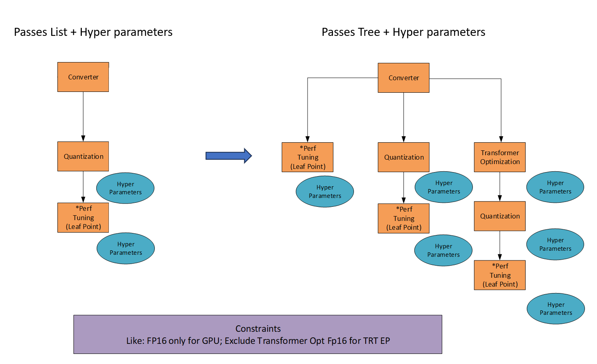
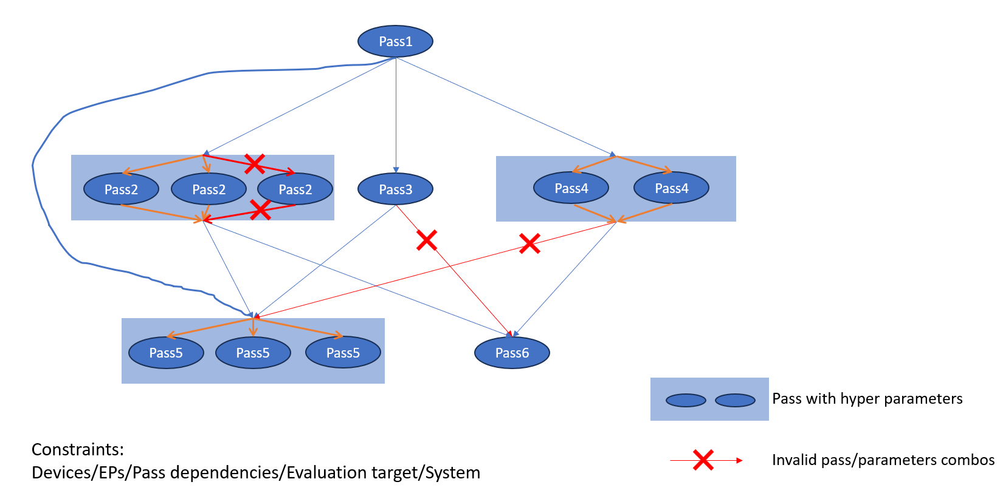

# Auto Optimization
Currently, we have a lot of optimization passes, and we need to manually select that with regard to the target hardware, model type and etc., which is not convenient. At the same time, the combination of optimization passes and passes parameters forms a huge search space, which is difficult to be explored manually and is not efficient. Therefore, we need to implement an auto optimization feature to automatically select the optimization passes to run.

Then think a bit more, to achieve the auto optimization, we need to solve the following problems:
1. How to define the search space?
2. What kind of search strategy to use?
3. How to support the parallel execution of the optimization passes?

## Define the search space

The search space is known as the set of all possible solutions to a problem. In our case, the search space is the set of all possible optimization `passes` and their `parameters`.

### Current implementation (Left part in the above figure)
In current implementation, user have to define the available `passes` and their `parameters` in the olive config file. That says:
1. The search space for Olive `passes` is fixed. We can not traverse multiple passes combinations.
2. The search space for passes `parameters` is flexible. We can traverse multiple parameters combinations for a single pass.

### Goal for auto optimization (Right part in the above figure)
In the auto optimization feature, we need to define the search space for `passes` and `parameters` in a more flexible way.
1. The search space for `passes` should support multiple passes combinations which is a `Tree`(or `DAG` in a generic way).
2. We can keep the original way to define the `parameters` search space now. But to achieve **the pure auto optimization**, we need to unify the `passes` selection and `parameters` into a single search space, which can help us to leverage the existing search strategy to traverse the Olive search space.
3. But this kind of unified search space will become *very large*, which is not efficient. So we need to define some priori knowledge to downsize the search space based on the constraint of device and etc.

Let us take a look at the following example:
- we have 6 passes: `pass1`, `pass2`, `pass3`, `pass4`, `pass5` and `pass6`.
    - `pass2` will be tuned with 3 parameters combinations.
    - `pass4` will be tuned with 2 parameters combinations.
    - `pass5` will be tuned with 3 parameters combinations.
    - other passes will be run directly *without hyper-parameters tuning*.

- then we have following passes combinations with some priori knowledge:
    1. `pass1` -> `pass2` -> `pass5` (some of parameters are invalid based on the constraint of device and etc.)
    2. `pass1` -> `pass3` -> `pass5`
    3. `pass1` -> `pass3` -> `pass6` (some of parameters are invalid based on the constraint of device and etc.)
    4. `pass1` -> `pass4` -> `pass5` (some of parameters are invalid based on the constraint of device and etc.)
    5. `pass1` -> `pass4` -> `pass6`
    6. `pass1` -> `pass5`

But in current implementation, we need to write 6 config files to run the above passes combinations one by one which is not convenient and efficient.

Based on the above example, we can see that it is necessary to define a unified search space for `passes` and `parameters` to achieve the auto optimization feature.

### TODOs
#### Downsize the search space for current implementation
- [ ] <a name="task_1">1</a>. *[P2]* Downsize the passes parameters search space.
  - [ ] <a name="task_1.1">1.1</a>. *[P2]* Downsize the search space based on optimization level which contains different passes parameters templates for different levels
  - [ ] <a name="task_1.2">1.2</a>. *[P2]* Downsize the search space based on the constraint of device, EPs, evaluation metrics and system.
- [ ] <a name="task_2">2</a>. *[P4]* Downsize the search space based on the priori knowledge of passes combinations.

#### Change the passes `List` to `DAG`
- [ ] <a name="task_3">3</a>. *[P3]* Change the passes `List` to `DAG` to support multiple passes combinations.
  - [ ] <a name="task_3.1">3.1</a>. *[P3]* Accept multiple passes `List` from users.
  - [ ] <a name="task_3.2">3.2</a>. *[P3]* Construct the passes `DAG` based on the passes `List` from users.
- [ ] <a name="task_4">4</a>. *[P4]* Unify the passes `DAG` and `parameters` to a single search space.
  - P4 is because we need to verify the feasibility of this idea. Unified search space contains `passes` and `parameters` simultaneously, which will make the search space heterogeneous. I am not sure whether we can find a good search strategy which can find a optimal solution in this heterogeneous search space.

## Search strategy
After we downsize and unify the search space, we need to define a search strategy to traverse the search space to find the best optimization passes and parameters combination.

Currently, we have following search algorithm to tune the hyper-parameters:
1. Exhaustive: does a grid search over the search space.
2. random: samples random points from the search space with or without replacement.
3. tpe: Tree-structured Parzen Estimator algorithm. Uses optuna TPESampler underneath. Refer to https://optuna.readthedocs.io/en/stable/reference/samplers/generated/optuna.samplers.TPESampler.html

Now, we can leverage these search algorithms to traverse the Olive `parameters` search space only.

Before we unify the `passes` and `parameters` search space(task [#4](#task_4)), current search strategy can leverage the existing search algorithms to traverse the `parameters` search space for each passes list which can be provided by users or constructed by Olive after task [#3](#task_3) is done.
The exhausted workflow is as follows:
1. Accept user's passes list or construct the passes list based on the passes `DAG`: e.g. `[[pass1, pass2, pass5], [pass1, pass3, pass5], ...]`
2. For each passes list, tune the `parameters` search space with above search algorithms.

But when we unify the `passes` and `parameters` search space, we need to find a good search strategy which can find a optimal solution in the heterogeneous search space.

### TODOs
- [ ] <a name="task_5">5</a>. *[P3]* Leverage the existing search algorithms to tune passes `parameters` search space **for each passes list**.
- [ ] <a name="task_6">6</a>. *[P4]* Investigate whether we can find a good search strategy which can find a optimal solution in the heterogeneous search space after task [#4](#task_4) is done.

## Parallel execution of optimization passes
In Olive optimization, we can run **multiple optimization passes** and **model evaluation** sequentially now. There is the big room to improve the performance of Olive optimization.

It is possible to run Olive optimization in parallel. But we need to consider the following things with different Olive systems:
1. Try different Devices/EPs in parallel in one Olive optimization.
   1. Local|PythonEnv|Docker system: ❌Multi-Device/EPs in parallel
   2. AML system: ✅Multi-Device/EPs in parallel
2. Besides the above, we also need to consider evaluate the model in parallel:
   1. Local|PythonEnv|Docker system: ✅Accuracy in parallel ❌Latency in parallel
   2. AML system: ✅Accuracy in parallel ✅Latency in parallel
3. Parallel execution in search space traversal, it is like search strategy can suggest multiple search point in one iteration and collect the evaluation results in parallel. Because the evaluation cannot be done in parallel in Local|PythonEnv|Docker system, so we can only do this in AML system.

### TODOs
- [ ] <a name="task_7">7</a>. *[P4]* Run Olive optimization in parallel:
  - [ ] EPs traversal in parallel
  - [ ] Passes run in parallel
  - [ ] Evaluation run in parallel
    - [ ] Latency
    - [ ] Accuracy
  - [ ] Search space traversal run in parallel
