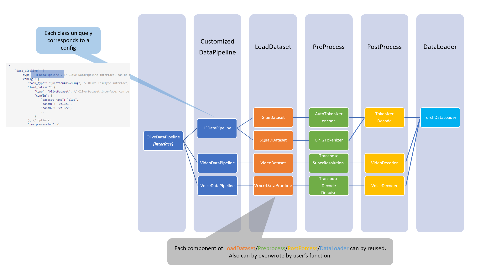

Olive Dataset Design
====================

### Overview

Currently, we have a few different dataset implementations in Olive. We should unify them under standardized Olive.Dataset/Olive.Dataloader interface which will be introduced in this design document.

### User scenarios

There are two main user scenarios for Olive dataset:
- Evaluate the intermediate models on the dataset.
    In this scenario, user will provide the function to load dataset and dataloader in user script which is passed into olive_pass with config string like following:
    ```json
    "evaluators": {
        "common_evaluator": {
            "metrics":[
                {
                    "name": "accuracy",
                    "type": "accuracy",
                    "sub_type": "accuracy_score",
                    "user_config":{
                        "post_processing_func": "post_process",
                        "user_script": "user_script.py",
                        "dataloader_func": "create_dataloader",
                        "batch_size": 1
                    }
                },
                {
                    "name": "latency",
                    "type": "latency",
                    "sub_type": "avg",
                    "user_config":{
                        "user_script": "user_script.py",
                        "dataloader_func": "create_dataloader",
                        "batch_size": 1
                    }
                }
            ],
            "target": "local_system"
        }
    },
    ```

    When the control flow reaches the evaluator, Olive will **load the user script** and **call the dataloader function** to get the dataloader.

    Then Olive will **iterate the dataloader** and call the model to get the prediction. Finally, Olive will call the post **processing function** to get the final prediction and calculate the metrics.

- Run Olive passes:
    - Conversion: requires user to provide the input samplers or input name and shape for Olive to generate the faked data.
    ```json
    "conversion": {
        "type": "OnnxConversion",
        "config": {
            "input_names": ["input_ids", "attention_mask", "token_type_ids"],
            "input_shapes": [[1, 128], [1, 128], [1, 128]],
            "input_types": ["int64", "int64", "int64"],
            "output_names": ["output"],
            "target_opset": 13
        }
    }
    ```
    - PerfTuning: same with Conversion.
    ```json
    "perf_tuning": {
        "type": "OrtPerfTuning",
        "config": {
            "user_script": "user_script.py",
            "dataloader_func": "create_dataloader",
            "batch_size": 1
        }
    }
    ```
    - Quantization: requires a set of calibration dataset, for different pass, there might be different calibration datasets.
    ```json
    "quantization": {
        "type": "OnnxQuantization",
        "config": {
            "user_script": "user_script.py",
            "dataloader_func": "glue_calibration_reader"
        }
    },
    ```
    - QAT: requires a whole dataset with annotations which can hold the same format with evaluation dataset.
    ```json
    "quantization_aware_training":{
        "type": "QuantizationAwareTraining",
        "config":{
            "input_shapes": [[1, 128], [1, 128], [1, 128]],
            "input_types": ["int64", "int64", "int64"],
            "user_script": "user_script.py",
            "training_loop_func": "training_loop_func"
        }
    },
    ```
    - Distillation: same with QAT

In above cases, user must to provide complete Dataset, Dataloader and Calibration Dataset.
We should provide a unified interface for Olive to load the dataset and try best to simplify the user experience.

We will tried to optimize Olive dataset related api from following aspects:
- [ ] **Unify dataset interface**: Provide a complete Olive Dataset interface which can be used in all above scenarios. The interface should be compatible with
    1. Torch dataset
    2. Huggingface dataset
    3. SNAP dataset (olive/snap/data_loader.py)
    4. OpenVINO dataset
    5. To add more...

- [ ] **Generate dummy input** For those pass or metric evaluation like perf-tuning and latency measurement
which can just take simple dummy tensors input or data shape/type as input,
we should provide a simple interface to generate the dummy input.
    **Requirement from AML integration, to make Olive v2 support dummy input for Perf-tuning pass*

- [ ] **Implement Dataset examples** Provide a series of Olive Dataset examples on popular datasets.
    - [ ] GLUE
    - [ ] SQUAD
    - [ ] MNIST
    - [ ] CIFAR10
    - [ ] To add more...
    The examples can be used as dataset input or as reference for user to implement their own dataset.

- [ ] **TBD user_config parameters sharing**: We noticed the different passes and evaluations will
try to load data respectively. That is helpful when the host and target system are not the same one.
As different pass run and evaluation are hold on different devices.
But when it comes to local run, the same dataset are load repeatedly.
We should try to optimize this with low priority?


### Design

#### General workflow for dataset load and processing
Before the introduction on Olive `DatasetPipeline` interface, we will first give the general workflow for
dataset load and processing in machine learning.


Then in above workflow, we can see the dataset load and processing can be divided into three steps(*not in Olive, just introduce the general workflow*):

1. User to prepare the dataset with given format before call Olive: `[data, annotation(optional), meta_data(optional)]`.
    - `data`: the input data for model to process, it can be a single tensor/text/files... or a list of tensors/text/files.
    - `annotation`: the label for the data, it can be a single tensor/text/files or a list of tensors/text/files.
    - `meta_data`: the meta data for the data, some information to tell the structure/parse way... of current data
2. After the data preparation, user can implement their methods to load the dataset and get the dataloader.
The steps would be like:
    - `load_dataset` to load the dataset.
    - `pre_process` to format the dataset and make it ready for model to consume. Could be optional if the dataset is ready for model inference.
    - `post_precess` to format the model output to the format which can be used for evaluation. Could be optional.
    - `calibration_post_func` to format the dataset and make it ready for quantization. Could be optional if there is no quantization.
After these, the DataPipeline will generate the dataloader with given batch_size/sample_ratio which can be used for model inference. User can also overwrite it with their own version.

3. After the dataloader is ready, user can call Olive to run the pass or evaluation.


#### Olive DataPipeline interface
Based on above workflow, we introduce the Olive `DataPipeline` interface which
1. unifies the dataset interface for different dataset, models and tasks.
2. gives the chance for Olive to implement the build-in `dataset`, `pre_process` and `post_process` and `dataloader`.
3. simplifies the user experience to implement their own `dataset`, `pre_process` and `post_process` and `dataloader`.
4. simplifies the user experience for some popular dataset models and tasks.

Then the design for `DataPipeline` interface will be like:


1. There will be build-in DataPipelines for different dataset, models and tasks which implement the Olive `DataPipeline` interface, like `HuggingfaceDataPipeline`, `VideoDataPipeline`, `VoiceDataPipeline`...
Each build-in DataPipeline uniquely corresponds to a template of config like:
    ```json
    {
        "data_pipeline": {
            "type": "OliveDataPipeline", // Olive DataPipeline interface, can be other available DataPipelines like HuggingfaceDataPipeline, VideoDataPipeline...
            "config": {
                "task_type": "QuestionAnswering", // Olive TaskType interface, can be other available TaskTypes like ClassificationTaskType, RegressionTaskType, SequenceLabelingTaskType, QuestionAnsweringTaskType ...
                "load_dataset": {
                    "type": "OliveDataset", // Olive Dataset interface, can be other available Datasets like HuggingfaceDataset, LocalDataset, SamplerDataset ...
                    "config": {
                        "dataset_name": "glue",
                        "param1": "value1",
                        "param2": "value2",
                        ...
                    }
                }, // optional
                "pre_processing": {
                    "type": "PreProcess", // Olive PreProcess interface, can be other available PreProcess like HuggingfacePreProcess, ToTorchTensorPreProcess, TokenizerPreProcess ...
                    "config": {
                        "param1": "value1",
                        "param2": "value2",
                        ...
                    }
                }, // optional
                "post_processing": {
                    "type": "PostProcess", // Olive PostProcess interface, can be other available PostProcess like HuggingfacePostProcess, ToTorchTensorPostProcess, TokenizerPostProcess ...
                    "config": {
                        "param1": "value1",
                        "param2": "value2",
                        ...
                    }
                }, // optional
                "dataloader": {
                    "type": "OliveDataLoader", // Olive DataLoader interface, can be other available DataLoaders like HuggingfaceDataLoader, LocalDataLoader, SamplerDataLoader ...
                    "config": {
                        "batch_size": 10,
                        "sample_ratio": 0.1,
                        ...
                    }
                } // optional
            }
        }
    }
    ```
2. User can implement their own `LoadDataset`, `PreProcess`, `PostProcess` and `DataLoader` to use the Olive `DataPipeline` interface. If one of the components is not implemented, the Olive will use the build-in default component to replace it.
3. User can user pre-defined register(`BaseClass` or `Decorator`) to register their own `LoadDataset`, `PreProcess`, `PostProcess` and `DataLoader` in `user_scripts`, then replace the build-in default component with their own one. The register usage will be like:
    ```python
    ############################## Decorator ##############################
    from olive import data_component_register
    from olive.constants import DataComponentType
    @data_component_register(DataComponentType.LoadDataset, "MyLoadDataset")
    def load_dataset():
        pass

    @data_component_register(DataComponentType.Preprocess, "MyPreprocess")
    def load_dataset():
        pass

    ############################## BaseClass ##############################
    from olive.data_component import BasePreProcess

    class MyPreProcess(BasePreProcess):
        def run(self, **kwargs):
            pass
    ```
4. `DataPipeline` will be used in `Pass` and `Evaluation` to load the dataset and get the dataloader. They will be used like the way of `System` in Olive config which can be defined once and used in different `Pass` and `Evaluation`.


The interface for `DataPipeline` and `DataComponent` will be like(to show the idea, not the final implementation):

    ```python
    # could leverage the AutoConfigClass in Olive is possible
    class DataComponent(ABC):
        registry: Dict[str, Type] = {}
        @classmethod
        def __init_subclass__(cls, **kwargs) -> None:
            """Register the metric."""
            super().__init_subclass__(**kwargs)
            if inspect.isabstract(cls):
                return
            name = cls.name if cls.name is not None else cls.__name__.lower()
            cls.registry[name] = cls

        def __init__(self, **kwargs):
            pass

        @abstractmethod
        def run(self, dataset=None):
            raise NotImplementedError

        def __call__(self):
            return self._run()

    # Default DataComponent which can be overwritten by user/or use the build-in ones
    class LoadDataSet(DataComponent):
        def __init__(self, config):
            super().__init__(config)

        def run(self, kwargs):
            return load_dataset(**kwargs)

    class PreProcess(DataComponent):
        def __init__(self, **kwargs):
            super().__init__(**kwargs)

        def run(self, dataset, **kwargs):
            pass

    class PostProcess(DataComponent):
        def __init__(self, **kwargs):
            super().__init__(**kwargs)

        def run(self, model_output, **kwargs):
            pass

    class DataLoader(DataComponent):
        def __init__(self, **kwargs):
            super().__init__(**kwargs)

        def run(self, dataset=None, batch_size, sample_ratio=1, **kwargs):
            return DataLoader(dataset, batch_size=batch_size, sample_ratio=sample_ratio, **kwargs)

    class DatasetPipeline(ABC):

        def __init__(
            self,
            pipeline_config: Dict[str, Any] = None,
        ):
            """
            batch_size: batch size
            inputs: user directly give the input samplers with the format of ['data', 'label', 'meta_data'(optional)]
            kwargs: other parameters
            """
            self.pipeline_config = pipeline_config
            self.init_component(self.pipeline_config)

        def to_json(self):
            return json.dumps(self.pipeline_config)

        @staticmethod
        def from_json(self, path):
            with open(path, "r") as f:
                pipeline_config = json.load(f)
            return DatasetPipeline(pipeline_config)

        def init_component(self, pipeline_config):
            # generate callable object
            self.load_dataset = LoadDataSet(**pipeline_config.get("load_dataset", {}))
            self.pre_process = PreProcess(**pipeline_config.get("pre_process", {}))
            self.post_process = PostProcess(**pipeline_config.get("post_process", {}))
            self.dataloader = DataLoader(**pipeline_config.get("dataloader", {}))

        def get_dataset(self, dataset_name, **kwargs):
            dataset = self.load_dataset(dataset_name, **kwargs)
            return self.pre_process(dataset, **kwargs)

        def get_dataloader(self, dataset_name, **kwargs):
            dataset = self.get_dataset(dataset_name, **kwargs)
            return self.dataloader(dataset, **kwargs)

        def get_calibration_dataloader(self, dataset_name, **kwargs):
            return self.get_dataloader(dataset_name, **kwargs)

        def get_post_process_func(self, **kwargs):
            return self.post_process

        def get_pre_process_func(self, **kwargs):
            return self.pre_process
    ```

#### Implement Dataset examples
When dataset interface is unified, we can tried to conduct more build-in data pipelines and data components.

### Reference
- [Torch Dataset](https://pytorch.org/tutorials/beginner/basics/data_tutorial.html#datasets-dataloaders)
- [HuggingFace Dataset](https://huggingface.co/docs/datasets/index)
- [Arch Dataset: Fast HF Dataset](https://microsoft.github.io/archai/getting_started/notebooks/nlp/fast_hf_dataset_provider.html#)
- [OpenVINO dataloader](https://docs.openvino.ai/latest/pot_compression_api_README.html#dataloader)
