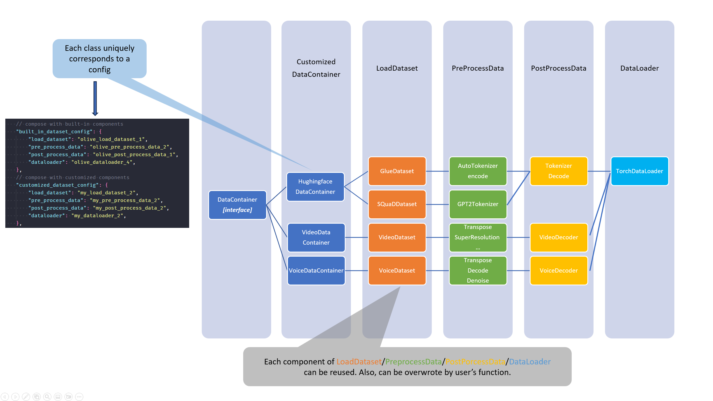

Olive Dataset Design
====================

### Overview

At present, there are several dataset implementations in Olive. To ensure consistency and ease of use, it is recommended that these be consolidated under a standardized Olive.data_container interface. This proposed interface will be explained in detail in the following design document.

### User scenarios

There are two primary user scenarios for the Olive dataset:
- valuating intermediate models using the dataset:
    In this scenario, the user will provide a function to load the dataset and dataloader in their script. This function will then be passed into Olive_pass along with a configuration string, as shown below:
    ```json
    "evaluators": {
        "common_evaluator": {
            "metrics":[
                {
                    "name": "accuracy",
                    "type": "accuracy",
                    "sub_type": "accuracy_score",
                    "user_config":{
                        "post_processing_func": "post_process",
                        "user_script": "user_script.py",
                        "dataloader_func": "create_dataloader",
                        "batch_size": 1
                    }
                },
                {
                    "name": "latency",
                    "type": "latency",
                    "sub_type": "avg",
                    "user_config":{
                        "user_script": "user_script.py",
                        "dataloader_func": "create_dataloader",
                        "batch_size": 1
                    }
                }
            ],
            "target": "local_system"
        }
    },
    ```

    When the control flow reaches the evaluator, Olive will **load the user script and call the dataloader function** to obtain the dataloader.

    Next, Olive will **iterate through the dataloader** and invoke the model to generate predictions. Finally, Olive will use the **post-processing** function to obtain the final prediction and calculate the appropriate metrics.

- Run Olive passes:
    - Conversion: The user must provide either input samplers or input names and shapes to enable Olive to generate synthetic data.
    ```json
    "conversion": {
        "type": "OnnxConversion",
        "config": {
            "input_names": ["input_ids", "attention_mask", "token_type_ids"],
            "input_shapes": [[1, 128], [1, 128], [1, 128]],
            "input_types": ["int64", "int64", "int64"],
            "output_names": ["output"],
            "target_opset": 13
        }
    }
    ```
    - PerfTuning: same with Conversion.
    ```json
    "perf_tuning": {
        "type": "OrtPerfTuning",
        "config": {
            "user_script": "user_script.py",
            "dataloader_func": "create_dataloader",
            "batch_size": 1
        }
    }
    ```
    - Quantization: A set of calibration datasets is required, and different calibration datasets may be necessary for different passes.
    ```json
    "quantization": {
        "type": "OnnxQuantization",
        "config": {
            "user_script": "user_script.py",
            "dataloader_func": "glue_calibration_reader"
        }
    },
    ```
    - QAT: A complete dataset with annotations is needed, and it must be in a format that is consistent with the evaluation dataset.
    ```json
    "quantization_aware_training":{
        "type": "QuantizationAwareTraining",
        "config":{
            "input_shapes": [[1, 128], [1, 128], [1, 128]],
            "input_types": ["int64", "int64", "int64"],
            "user_script": "user_script.py",
            "training_loop_func": "training_loop_func"
        }
    },
    ```
    - Distillation: same with QAT

In the cases mentioned above, the user is required to provide a complete dataset, dataloader, and calibration dataset. To make the user experience simpler, we should provide a unified interface for Olive to load the dataset and streamline the process

Here are some additional ways in which Olive's dataset-related API could be optimized:
- [ ] **Unify dataset interface**: We need to develop a comprehensive Olive Dataset interface that can be used in all the scenarios mentioned above. This interface should be designed to be compatible with different types of datasets and should be easy to use.
    1. Torch dataset
    2. Huggingface dataset
    3. SNAP dataset (olive/snap/data_loader.py)
    4. OpenVINO dataset
    5. To add more...

- [ ] **Generate dummy input** In cases where pass or metric evaluation, such as perf-tuning and latency measurement,
only require simple dummy tensor inputs or data shape/type inputs, we should provide a simple interface to generate
the dummy input. This will make the evaluation process more efficient and user-friendly.

- [ ] **Implement Dataset examples** Provide a series of Olive Dataset examples on popular datasets.
    - [ ] GLUE
    - [ ] SQUAD
    - [ ] MNIST
    - [ ] CIFAR10
    - [ ] To add more...
    These examples can serve as either dataset inputs or as a reference for users to implement their own datasets. Users can utilize these examples to help them better understand the structure and format of the data they need to provide, making the dataset creation process easier and more efficient.

### Design

#### General workflow for dataset load and processing
Before introducing the Olive `DatasetContainer` interface, let's first outline the general workflow for loading and processing datasets in machine learning.


Based on the above workflow, we can see that dataset loading and processing can be divided into three steps:

1. User to prepare the dataset with given format before call Olive: `[data, annotation(optional), meta_data(optional)]`.
    - `data`: The input data for the model to process. This can be a single tensor, text, file, or a list of tensors, texts, or files.
    - `annotation`: The label for the data. This can be a single tensor, text, file, or a list of tensors, texts, or files.
    - `meta_data`: The metadata for the data. This includes information that can help with understanding the structure or parsing of the current data.
2. After preparing the data, users can implement their own methods to load the dataset and obtain the dataloader.
The steps would be like:
    - `dataset` to construct the dataset.
    - `pre_process` to format the dataset and make it ready for model to consume. Could be optional if the dataset is ready for model inference. Noted that the data after `dataset` and `pre_process` should be return `(data, label)` with `__getitem__` methods.
    - `post_precess` to format the model output to the format which can be used for evaluation. Could be optional.
    - `data_loader` to generate the dataloader with given batch_size/sample_ratio.
After these, the DataContainer will generate the dataloader with given batch_size/sample_ratio which can be used for model inference. User can also overwrite it with their own version.

3. After the dataloader is ready, user can call Olive to run the pass or evaluation.


#### Olive DataContainer interface
Based on above workflow, we introduce the Olive `DataContainer` interface which
1. unifies the dataset interface for different dataset, models and tasks.
2. gives the chance for Olive to implement the build-in `dataset`, `pre_process` and `post_process` and `dataloader`.
3. simplifies the user experience to implement their own `dataset`, `pre_process` and `post_process` and `dataloader`.
4. simplifies the user experience for some popular dataset models and tasks.

Then the design for `DataContainer` interface will be like:


1. There will be build-in DataContainers for different datasets, models and tasks, which implement the Olive `DataContainer` interface, like `HuggingfaceDataContainer`, `VideoDataContainer`, `VoiceDataContainer` and more.
Each build-in DataContainer uniquely corresponds to a template of config like:
    ```json
    {
        "data_container": {
            "type": "BaseContainer", // Olive BaseContainer interface, can be other available DataContainers like HuggingfaceDataContainer, VideoDataContainer...
            "config": {
                "task_type": "QuestionAnswering", // Olive TaskType interface, can be other available TaskTypes like ClassificationTaskType, RegressionTaskType, SequenceLabelingTaskType, QuestionAnsweringTaskType ...
                "load_dataset": {
                    "type": "default_load_dataset", // Olive Dataset interface, can be other available Datasets like HuggingfaceDataset, LocalDataset, SamplerDataset ...
                    "config": {
                        "dataset_name": "glue",
                        "param1": "value1",
                        "param2": "value2",
                        ...
                    }
                }, // optional
                "pre_precess": {
                    "type": "pre_precess", // Olive pre_precess interface, can be other available PreProcess like HuggingfacePreProcess, ToTorchTensorPreProcess, TokenizerPreProcess ...
                    "config": {
                        "param1": "value1",
                        "param2": "value2",
                        ...
                    }
                }, // optional
                "post_process": {
                    "type": "post_process", // Olive post_process interface, can be other available PostProcess like HuggingfacePostProcess, ToTorchTensorPostProcess, TokenizerPostProcess ...
                    "config": {
                        "param1": "value1",
                        "param2": "value2",
                        ...
                    }
                }, // optional
                "dataloader": {
                    "type": "default_dataloader", // Olive DataLoader interface, can be other available DataLoaders like HuggingfaceDataLoader, LocalDataLoader, SamplerDataLoader ...
                    "config": {
                        "batch_size": 10,
                        "sample_ratio": 0.1,
                        ...
                    }
                } // optional
            }
        }
    }
    ```
2. User can implement their own `dataset`, `pre_process`, `post_process` and `dataloader` to use the Olive `DataContainer` interface. If one of the components is not implemented, the Olive will use the build-in default component to replace it.
3. User can use pre-defined register(`Decorator`) to register their own `dataset`, `pre_process`, `post_process` and `dataloader` in `user_scripts`, then replace the build-in default component with their own one. The register usage will be like:
    ```python
    ############################## Decorator ##############################
    @Registry.register_dataset("test_dataset")
    def _test_dataset(test_value):
        ...

    @Registry.register_dataloader()
    def _test_dataloader(test_value):
        ...

    @Registry.register_pre_process()
    def _pre_process(test_value):
        ...

    @Registry.register_post_process()
    def _post_process(test_value):
        ...

    DataContainerConfig(
        components={
            "dataset": {
                "name": "test_dataset",
                "type": "test_dataset",
                "params": {"test_value": "test_value"},
            },
            "dataloader": {
                "name": "test_dataloader",
                "type": "_test_dataloader",  # This is the key to get dataloader
                "params": {"test_value": "test_value"},
            },
        }
    )
    ```
4. `DataContainer` will be used in `Pass` and `Evaluation` to load the dataset and get the dataloader. They will be used like the way of `System` in Olive config which can be defined once and used in different `Pass` and `Evaluation`, for example:
```json
{
    "verbose": true,
    "input_model":{
        "type": "PyTorchModel",
        "config": {
            "hf_config": {
                "model_name": "Intel/bert-base-uncased-mrpc",
                "task": "text-classification"
            },
            "io_config" : {
                "input_names": ["input_ids", "attention_mask", "token_type_ids"],
                "input_shapes": [[1, 128], [1, 128], [1, 128]],
                "input_types": ["int64", "int64", "int64"],
                "output_names": ["output"]
            }
        }
    },
    "systems": {
        ...
    },
    "evaluators": {
        "common_evaluator": {
            "metrics":[
                {
                    ...
                    "data_container": "my_container" // <-------------------
                },
            ],
            "target": "local_system"
        }
    },
    "passes": {
        "conversion": {
           ...
        },
        "transformers_optimization": {
            ...
        },
        "quantization": {
            "type": "OnnxQuantization",
            "config": {
                "data_container": "my_container" // <-------------------
            }
        },
    },
    "engine": {
        ...
    },
    "data_container": {
        "my_container": { // <-------------------
            "name": "glue",
            "type": "HuggingfaceContainer",
            "params_config": {
                "data_name": "glue",
                "subset": "mrpc",
                "split": "validation",
                "input_cols": ["sentence1", "sentence2"],
                "label_cols": ["label"],
                "batch_size": 1
            }
        }
    }
}
```

#### Relationship between `DataContainer` and `DataComponent`

`DataContainer` is the endpoint used to call the components under `DataComponent`, which include `dataset`, `pre_process`, `post_process` and `dataloader`. The relationship between `DataContainer` and `DataComponent` is as folows:
```python
DefaultDataComponentCombos = {
    DataComponentType.DATASET.value: DefaultDataComponent.DATASET.value,
    DataComponentType.PRE_PROCESS.value: DefaultDataComponent.PRE_PROCESS.value,
    DataComponentType.POST_PROCESS.value: DefaultDataComponent.POST_PROCESS.value,
    DataComponentType.DATALOADER.value: DefaultDataComponent.DATALOADER.value,
}


class DataContainerConfig(ConfigBase):
    name: str = DefaultDataContainer.DATA_CONTAINER.value
    type: str = DefaultDataContainer.DATA_CONTAINER.value

    # used to store the params for each component
    params_config: dict = None

    components: dict[str, DataComponentConfig] = None
    default_components: dict[str, DataComponentConfig] = None
    default_components_type: dict[str, str] = None
```


#### Implement Dataset examples
When dataset interface is unified, we can tried to conduct more build-in data containers and data components.

### Reference
- [Torch Dataset](https://pytorch.org/tutorials/beginner/basics/data_tutorial.html#datasets-dataloaders)
- [HuggingFace Dataset](https://huggingface.co/docs/datasets/index)
- [Arch Dataset: Fast HF Dataset](https://microsoft.github.io/archai/getting_started/notebooks/nlp/fast_hf_dataset_provider.html#)
- [OpenVINO dataloader](https://docs.openvino.ai/latest/pot_compression_api_README.html#dataloader)
