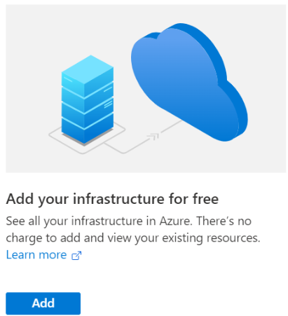
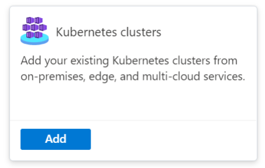
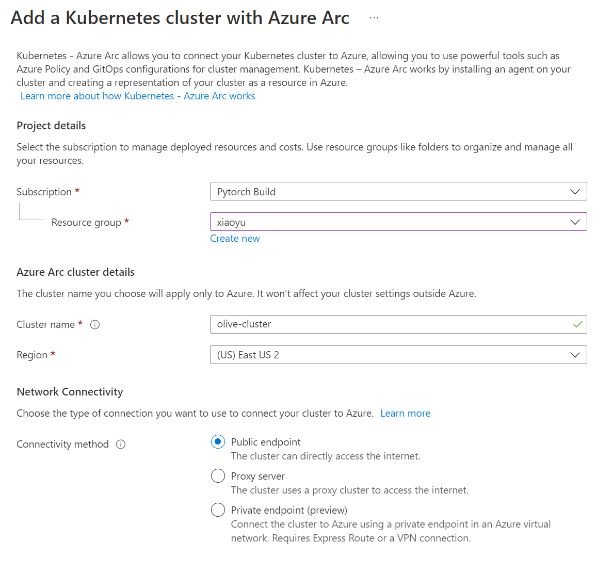
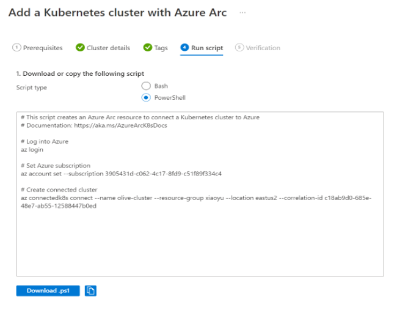
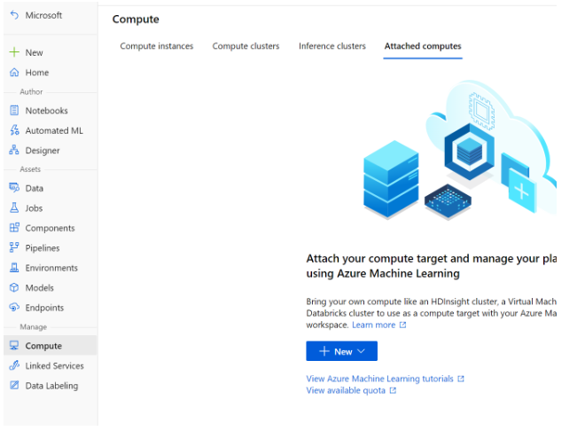
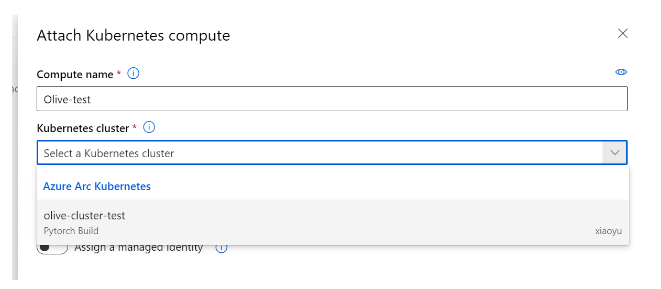
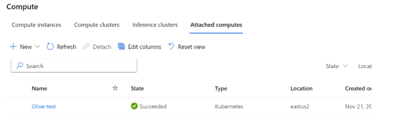

# Self-hosted Kubernetes cluster

 In this document, you will learn how to create a local Kubernetes cluster, deploy it to Azure Arc, and link it to your Azure machine learning workspace computes.

## Create Kubernetes cluster

- Please make sure Docker is installed: [Docker Engine installation overview | Docker Documentation](https://docs.docker.com/engine/install/)
- Create local Kubernetes cluster. We will use [kind: kind (k8s.io)](https://kind.sigs.k8s.io/) to create the cluster in this tutorials:
  - Run command `kind create cluster`
  - Please note that this command will create Kubernetes cluster config file in default path: `“$HOME/.kube/config”`. You can specify other kubeconfig files by setting the KUBECONFIG environment variable or by setting the `--kubeconfig` flag.
  - Kubernetes config documentation link: [Organizing Cluster Access Using kubeconfig Files | Kubernetes](https://kubernetes.io/docs/concepts/configuration/organize-cluster-access-kubeconfig/)

## Add local Kubernetes cluster to Azure Arc

- Lunch Azure Arc page at [Microsoft Azure Arc](https://ms.portal.azure.com/#view/Microsoft_Azure_HybridCompute/AzureArcCenterBlade/~/overview)
- Select `Add your infrastructure for free`:  

- Select `Kubernetes clusters`:

- Fill out cluster details:

- Download and run the script on local machine

  

It may take several minutes to link the cluster to Azure Arc. Then you should be able to see cluster verification passes in the last step.

## Add AML extension to cluster

- Please follow the instructions to add AML extension to your Azure Arc Kubernetes: [Deploy AzureML extension on Kubernetes cluster - Azure Machine Learning | Microsoft Learn](https://learn.microsoft.com/en-us/azure/machine-learning/how-to-deploy-kubernetes-extension?view=azureml-api-2&tabs=portal)

## Link Azure Arc Kubernetes cluster to Azure Machine Learning

- In your Azure Machine Learning Workspace, select `Compute` – `Attached computes` – `New` – `Kubernetes`

- Select cluster that you created before - Attach:

- You should be able to use attached computes for your machine learning jobs here:

