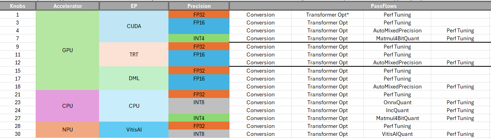

.. _how_to_configure_auto_optimizer:

How To Configure Auto Optimizer
=======================================

Auto Optimizer is a tool that can be used to automatically search Olive passes combination based on:

1. input model
2. target device
3. target precision: ``fp32``, ``fp16``, ``int8``, ``int4`` and etc.
4. target evaluation metric: accuracy, latency and etc.

All above information(is called "optimization factors" in this doc) is provided by user through a configuration file now, then run by:

.. code-block::

    olive run --config <config_file>.json

With the help of Auto Optimizer:

1. User DOES NOT need to provide the passes combination manually.
2. User DOES NOT need to write redundant passes configs.

At the same time, user still has the flexibility to specify the accelerator, execution providers and expected precision of output models.

Currently, **auto optimizer supports onnx optimization stack only**. For original OpenVINO (IR MODEL) and SNPE, user still need to provide passes combination manually by now.
Auto Optimizer is still under development actively, and we will keep improving it to make it more powerful and easy to use.

Auto Optimizer Configuration
----------------------------

Config Fields:

    1. opt_level[int]: default 0, to look up built-in passes template.

    2. disable_auto_optimizer[bool]: default False.
        - If set to True, Auto Optimizer will be disabled and user need to provide passes combination manually.

    3. precision[optional[str]]: default None.
        - The precision of output model. If user does not set the precision of output model, it will be determined by above optimization factors. Olive supports "fp32", "fp16" and "int8" output precision for now.

    Here is a simple example of Auto Optimizer configuration, the item which is not provided will use the default value:

.. code-block:: json

    {
        "engine": {
            "search_strategy": {
                "execution_order": "joint",
                "search_algorithm": "tpe",
                "search_algorithm_config": {
                    "num_samples": 1,
                    "seed": 0
                }
            },
            "evaluator": "common_evaluator",
            "cache_dir": "cache",
            "output_dir" : "models/bert_gpu"
        },
        "auto_optimizer_config": {
            "opt_level": 0,
            "disable_auto_optimizer": false,
            "precision": "fp16"
        }
    }

.. note::
    In this example, Auto Optimizer will search for the best passes combination for different execution providers, e.g. CUDAExecutionProvider and TensorrtExecutionProvider.

    - For CUDAExecutionProvider, it will try float16 in ``OrtTransformersOptimization``.

    - For TensorrtExecutionProvider, it will try trt_fp16 in ``OrtPerfTuning``.

Here the available pass flows for given accelerator, execution providers and precision:

Auto Optimizer can catch up with manual settings in most cases, and it is more convenient to use.

Here is another quick comparison between Auto Optimizer and manual settings.

.. tabs::
    .. tab:: Auto Optimizer

        .. code-block:: json
            :linenos:

            {
                "input_model":{
                    "type": "HfModel",
                    "model_path": "Intel/bert-base-uncased-mrpc",
                    "task": "text-classification"
                },
                "systems": {
                    "local_system": {
                        "type": "LocalSystem",
                        "accelerators": [
                            {
                                "device": "gpu",
                                "execution_providers": [
                                    "CUDAExecutionProvider",
                                    "TensorrtExecutionProvider"
                                ]
                            }
                        ]
                    }
                },
                "data_configs": [{
                    "name": "glue",
                    "type": "HuggingfaceContainer",
                    "load_dataset_config": {
                        "data_name": "glue",
                        "split": "validation",
                        "subset": "mrpc"
                    },
                    "pre_process_data_config": {
                        "input_cols": [ "sentence1", "sentence2" ],
                        "label_cols": [ "label" ]
                    },
                    "dataloader_config": {
                        "batch_size": 1
                    }
                }],
                "evaluators": {
                    "common_evaluator": {
                        "metrics":[
                            {
                                "name": "accuracy",
                                "type": "accuracy",
                                "backend": "huggingface_metrics",
                                "data_config": "glue",
                                "sub_types": [
                                    {"name": "accuracy", "priority": 1, "goal": {"type": "max-degradation", "value": 0.01}},
                                    {"name": "f1"}
                                ]
                            },
                            {
                                "name": "latency",
                                "type": "latency",
                                "data_config": "glue",
                                "sub_types": [
                                    {"name": "avg", "priority": 2, "goal": {"type": "percent-min-improvement", "value": 20}},
                                    {"name": "max"},
                                    {"name": "min"}
                                ]
                            }
                        ]
                    }
                },
                "search_strategy": {
                    "execution_order": "joint",
                    "search_algorithm": "tpe",
                    "num_samples": 1,
                    "seed": 0
                },
                "evaluator": "common_evaluator",
                "host": "local_system",
                "target": "local_system",
                "cache_dir": "cache",
                "output_dir" : "models/bert_gpu"
            }

    .. tab:: Manual Settings for CUDA&TRT EP

        .. code-block:: json
            :linenos:

            {
                "input_model":{
                    "type": "HfModel",
                    "model_path": "Intel/bert-base-uncased-mrpc",
                    "task": "text-classification"
                },
                "systems": {
                    "local_system": {
                        "type": "LocalSystem",
                        "accelerators": [
                            {
                                "device": "gpu",
                                "execution_providers": [
                                    "CUDAExecutionProvider",
                                    "TensorrtExecutionProvider"
                                ]
                            }
                        ]
                    }
                },
                "data_configs": [{
                    "name": "glue",
                    "type": "HuggingfaceContainer",
                    "load_dataset_config": {
                        "data_name": "glue",
                        "split": "validation",
                        "subset": "mrpc"
                    },
                    "pre_process_data_config": {
                        "max_samples": 100,
                        "input_cols": [ "sentence1", "sentence2" ],
                        "label_cols": [ "label" ]
                    },
                    "dataloader_config": {
                        "batch_size": 1
                    }
                }],
                "evaluators": {
                    "common_evaluator": {
                        "metrics":[
                            {
                                "name": "accuracy",
                                "type": "accuracy",
                                "backend": "huggingface_metrics",
                                "data_config": "glue",
                                "sub_types": [
                                    {"name": "accuracy", "priority": 1, "goal": {"type": "max-degradation", "value": 0.01}},
                                    {"name": "f1"}
                                ]
                            },
                            {
                                "name": "latency",
                                "type": "latency",
                                "data_config": "glue",
                                "sub_types": [
                                    {"name": "avg", "priority": 2, "goal": {"type": "percent-min-improvement", "value": 20}},
                                    {"name": "max"},
                                    {"name": "min"}
                                ]
                            }
                        ]
                    }
                },
                "passes": {
                    "conversion": {
                        "type": "OnnxConversion"
                    },
                    "cuda_transformers_optimization": {
                        "type": "OrtTransformersOptimization",
                        "float16": true
                    },
                    "trt_transformers_optimization": {
                        "type": "OrtTransformersOptimization",
                        "float16": false
                    },
                    "cuda_perf_tuning": {
                        "type": "OrtPerfTuning",
                        "enable_cuda_graph": true,
                        "io_bind": true,
                        "data_config": "glue"
                    },
                    "trt_perf_tuning": {
                        "type": "OrtPerfTuning",
                        "enable_cuda_graph": false,
                        "enable_trt_fp16": true,
                        "io_bind": true,
                        "data_config": "glue"
                    }
                },
                "pass_flows": [
                    ["conversion", "cuda_transformers_optimization", "cuda_perf_tuning"],
                    ["conversion", "trt_transformers_optimization", "trt_perf_tuning"]
                ],
                "search_strategy": {
                    "execution_order": "joint",
                    "search_algorithm": "tpe",
                    "num_samples": 1,
                    "seed": 0
                },
                "evaluator": "common_evaluator",
                "host": "local_system",
                "target": "local_system",
                "cache_dir": "cache",
                "output_dir" : "models/bert_gpu"
            }

.. note::
    In this example, Auto Optimizer can use default settings to catch up with manual settings. Auto Optimizer is aware of following rules which requires expert knowledge in manual settings:

    1. For CUDAExecutionProvider:
        - it would be better to disable ``enable_trt_fp16`` and enable ``enable_cuda_graph`` in ``OrtPerfTuning`` pass, and enable ``float16`` in ``OrtTransformersOptimization`` pass.

    2. For TensorrtExecutionProvider:
        - it would be better to enable ``enable_trt_fp16`` and disable ``enable_cuda_graph`` in ``OrtPerfTuning`` pass, and disable ``float16`` in ``OrtTransformersOptimization`` pass.

    3. At the same time, for both CUDAExecutionProvider and TensorrtExecutionProvider:
        - it would be better to enable ``io_bind`` in ``OrtPerfTuning`` pass.
