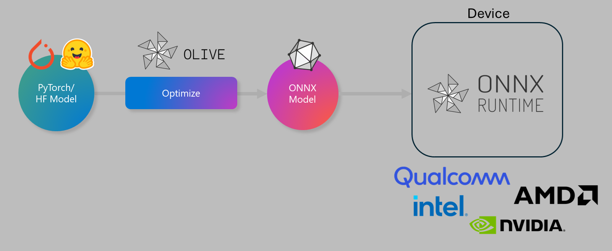

---
hide:
  - navigation
  - toc
---

# Overview

## What is OLIVE?

```{div} result



OLIVE (**O**NNX **LIVE**) is a cutting-edge model optimization toolkit with an accompanying CLI that enables you to ship models for the [ONNX runtime](https://onnxruntime.ai) with quality and performance. 

The input to OLIVE is typically a PyTorch or Hugging Face model, and the output is an optimized ONNX model that is executed on a device (deployment target) running the ONNX runtime. OLIVE will optimize the model for the deployment target's AI accelerator (NPU, GPU, CPU) provided by a hardware vendor such as Qualcomm, AMD, Nvidia, or Intel. 

OLIVE executes a *workflow*, which is an ordered sequence of individual model optimization tasks called *passes* - example passes include model compression, graph capture, quantization, and graph optimization. Each pass has a set of parameters that can be tuned to achieve the best metrics, such as accuracy and latency, that are evaluated by the respective *evaluator*. OLIVE employs a *search strategy* that uses a *search algorithm* to auto-tune each pass individually or a set of passes together.
```

## Benefits of using OLIVE

{octicon}`check-circle-fill;1em;sd-text-success` **Reduce frustration and time** of trial-and-error manual experimentation with different techniques for graph optimization, compression, and quantization. Define your quality and performance constraints and let OLIVE automatically find the best model for you.   
{octicon}`check-circle-fill;1em;sd-text-success` **40+ built-in model optimization components** covering cutting-edge techniques in quantization, compression, graph optimization, and finetuning.   
{octicon}`check-circle-fill;1em;sd-text-success` **Easy-to-use CLI** for common model optimization tasks. For example, `olive quantize`, `olive auto-opt`, `olive finetune`.   
{octicon}`check-circle-fill;1em;sd-text-success` Model packaging and deployment built-in.   
{octicon}`check-circle-fill;1em;sd-text-success` Supports **Multi LoRA serving**.   
{octicon}`check-circle-fill;1em;sd-text-success` Construct *workflows* using YAML/JSON to *orchestrate* model optimization and deployment tasks.   
{octicon}`check-circle-fill;1em;sd-text-success` Hugging Face and Azure AI Integration.   
{octicon}`check-circle-fill;1em;sd-text-success` Built-in **caching** mechanism to save costs.

## Try OLIVE

[{octicon}`arrow-right;1em;sd-text-info` Getting started](getting-started/getting-started.md)
