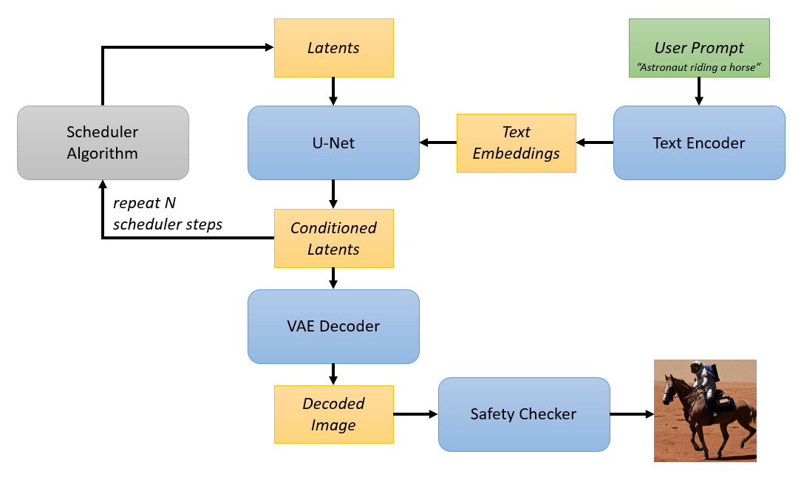
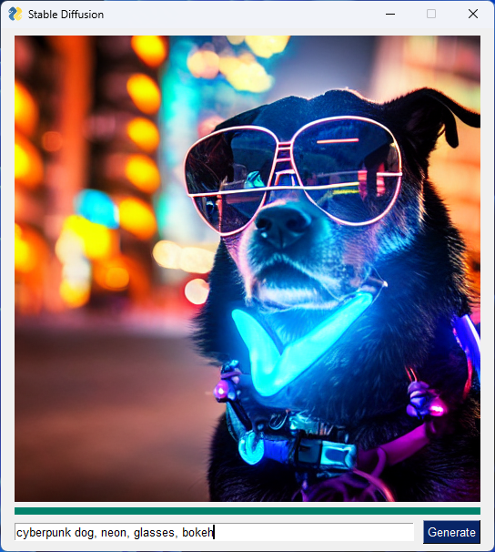

# Stable Diffusion Optimization with DirectML <!-- omit in toc -->

    ⚠️ THIS SAMPLE IS A WORK IN PROGRESS AND REQUIRES ONNXRUNTIME-DIRECTML 1.15+ (NOT YET RELEASED) ⚠️

This sample shows how to optimize [Stable Diffusion v1-5](https://huggingface.co/runwayml/stable-diffusion-v1-5) to run with ONNX Runtime and DirectML.

- [Stable Diffusion Pipeline](#stable-diffusion-pipeline)
- [Setup](#setup)
- [Conversion to ONNX and Latency Optimization](#conversion-to-onnx-and-latency-optimization)
- [Test Inference](#test-inference)
- [LoRA Models (Experimental)](#lora-models-experimental)
- [Issues](#issues)

# Stable Diffusion Pipeline

Stable Diffusion comprises multiple PyTorch models tied together into a *pipeline*. This Olive sample will convert each PyTorch model to ONNX, and then run the converted ONNX models through the `OrtTransformersOptimization` pass. The transformer optimization pass performs several time-consuming graph transformations that make the models more efficient for inference at runtime.


*Based on figure from [Hugging Face Blog](https://huggingface.co/blog/stable_diffusion) that covers Stable Diffusion with Diffusers library. Blue boxes are the converted & optimized ONNX models. Gray boxes remain implemented by diffusers library.*

# Setup

Make sure that your Python environment has `onnxruntime-directml` along with other dependencies in this sample's [requirements.txt](requirements.txt):

```
pip install -r requirements.txt
```

# Conversion to ONNX and Latency Optimization

The easiest way to optimize the pipeline is with the `stable_diffusion.py` helper script:

```
python stable_diffusion.py --optimize
```

The stable diffusion models are large, and the optimization process is resource intensive. It is recommended to run optimization on a system with a minimum of 16GB of memory (preferably 32GB). Expect optimization to take several minutes (especially the U-Net model).

Once the script successfully completes:
- The optimized ONNX pipeline will be stored under `models/optimized/runwayml/stable-diffusion-v1-5`.
- The unoptimized ONNX pipeline (models converted to ONNX, but not run through transformer optimization pass) will be stored under `models/unoptimized/runwayml/stable-diffusion-v1-5`.

Re-running the script with `--optimize` will delete the output models, but it will *not* delete the Olive cache. Subsequent runs will complete much faster since it will simply be copying previously optimized models; you may use the `--clean_cache` option to start from scratch (not typically used unless you are modifying the scripts, for example).

# Test Inference

This sample code is primarily intended to illustrate model optimization with Olive, but it also provides a simple interface for testing inference with the ONNX models. Inference is done by creating an `OnnxStableDiffusionPipeline` from the saved models, which leans on ONNX runtime for runtime inference of the core models (text encoder, u-net, decoder, and safety checker).

Invoke the script with `--interactive` to show the GUI and generate images one at a time.

```
python stable_diffusion.py --interactive
Loading models into ORT session...

Inference Batch Start (batch size = 1).
100%|█████████████████████████████| 51/51 [00:05<00:00,  9.40it/s]
Generated result_0.png
Inference Batch End (1/1 images passed the safety checker).
```

Inference will loop until the generated image passes the safety checker (otherwise you would see black images). The result will be saved as `result_0.png` on disk, which is then loaded and displayed in the UI. Example below:



You can also generate multiple images at once. The example below shows how to request 4 valid outputs (all using the same prompt), which will be saved as `result_0.png`, `result_1.png`, and so on. The script ran inference 6 times, because 2 of the outputs failed the safety checker.

```
python .\stable_diffusion.py --num_images 4 --prompt "solar eclipse, stars, realistic, space"
Loading models into ORT session...

Inference Batch Start (batch size = 1).
100%|█████████████████████████████| 51/51 [00:05<00:00,  8.92it/s]
Inference Batch End (0/1 images passed the safety checker).

Inference Batch Start (batch size = 1).
100%|█████████████████████████████| 51/51 [00:05<00:00,  9.40it/s]
Generated result_0.png
Inference Batch End (1/1 images passed the safety checker).

Inference Batch Start (batch size = 1).
100%|█████████████████████████████| 51/51 [00:05<00:00,  9.61it/s]
Generated result_1.png
Inference Batch End (1/1 images passed the safety checker).

Inference Batch Start (batch size = 1).
100%|█████████████████████████████| 51/51 [00:05<00:00,  9.68it/s]
Generated result_2.png
Inference Batch End (1/1 images passed the safety checker).

Inference Batch Start (batch size = 1).
100%|█████████████████████████████| 51/51 [00:05<00:00,  9.51it/s]
Inference Batch End (0/1 images passed the safety checker).

Inference Batch Start (batch size = 1).
100%|█████████████████████████████| 51/51 [00:05<00:00,  9.54it/s]
Generated result_3.png
Inference Batch End (1/1 images passed the safety checker).
```

If your graphics card has sufficient memory, you can try increasing the batch size to generate multiple images at the same time. This can be faster than generating single images at a time.

```
python .\stable_diffusion.py --num_images 16 --prompt "solar eclipse, stars, realistic, space" --batch_size 8
Loading models into ORT session...

Inference Batch Start (batch size = 8).
100%|█████████████████████████████| 51/51 [00:09<00:00,  5.54it/s]
Generated result_0.png
Generated result_1.png
Generated result_2.png
Generated result_3.png
Generated result_4.png
Generated result_5.png
Generated result_6.png
Generated result_7.png
Inference Batch End (8/8 images passed the safety checker).

Inference Batch Start (batch size = 8).
100%|█████████████████████████████| 51/51 [00:08<00:00,  6.22it/s]
Generated result_8.png
Generated result_9.png
Generated result_10.png
Generated result_11.png
Generated result_12.png
Generated result_13.png
Generated result_14.png
Generated result_15.png
Inference Batch End (8/8 images passed the safety checker).
```

Finally, you may adjust the number of steps in the U-net loop by setting `--num_inference_steps <steps>`. The default value is 50, but a lower value may produce sufficiently high quality images while taking less time overall.

# LoRA Models (Experimental)

This script also supports optimizing [LoRA variants of the base Stable Diffusion model](https://huggingface.co/blog/lora). When optimizing or running inference, specify the LoRA model ID instead of the base model ID. For example:

```
# Optimization:
python .\stable_diffusion.py --optimize --model "sayakpaul/sd-model-finetuned-lora-t4"

# Inference:
python .\stable_diffusion.py --interactive --model "sayakpaul/sd-model-finetuned-lora-t4"
```

In the above example, `sayakpaul/sd-model-finetuned-lora-t4` is based on `CompVis/stable-diffusion-v1-4`, so the text encoder, VAE decoder, and safety checker models will be optimized just as if you were optimizing `CompVis/stable-diffusion-v1-4`. The U-Net model, however, will have the LoRA weights merged into it.

**Implementation details**

LoRA adds additional linear layers (attention processors) to the base PyTorch model. The additional layers have their own weights (the "LoRA weights"), which are independent of the base model layers, and this allows users to replace only a portion of the the PyTorch weights when switching between LoRA model variants. Without preprocessing, the additional linear layers reduce inference latency. Olive will merge the weights of the LoRA layers into existing layers of the base model to eliminate this overhead, but this means you can no longer replace a portion of the weights in the optimized ONNX models; when changing between LoRA model variants, you must optimize each variant independently.

The diffusers library has an API ([diffusers.loaders.LoraLoaderMixin](https://huggingface.co/docs/diffusers/api/loaders#diffusers.loaders.LoraLoaderMixin)) to load the LoRA layers and their weights into the base model with a custom scale factor, which controls the strength of the LoRA weights (0.0 = no effect, 1.0 = max effect). In this Olive script, the scale is always 1.0 (see `merge_lora_weights` in user_script.py).

# Issues

If you run into the following error while optimizing models, it is likely that your local HuggingFace cache has an incomplete copy of the stable diffusion model pipeline. Deleting `C:\users\<username>\.cache\huggingface` should resolve the issue by ensuring a fresh copy is downloaded.

```
OSError: Can't load tokenizer for 'C:\Users\<username>\.cache\huggingface\hub\models--runwayml--stable-diffusion-v1-5\snapshots\<sha>'. If you were trying to load it from 'https://huggingface.co/models', make sure you don't have a local directory with the same name. Otherwise, make sure 'C:\Users\<username>\.cache\huggingface\hub\models--runwayml--stable-diffusion-v1-5\snapshots\aa9ba505e1973ae5cd05f5aedd345178f52f8e6a' is the correct path to a directory containing all relevant files for a CLIPTokenizer tokenizer.
```
