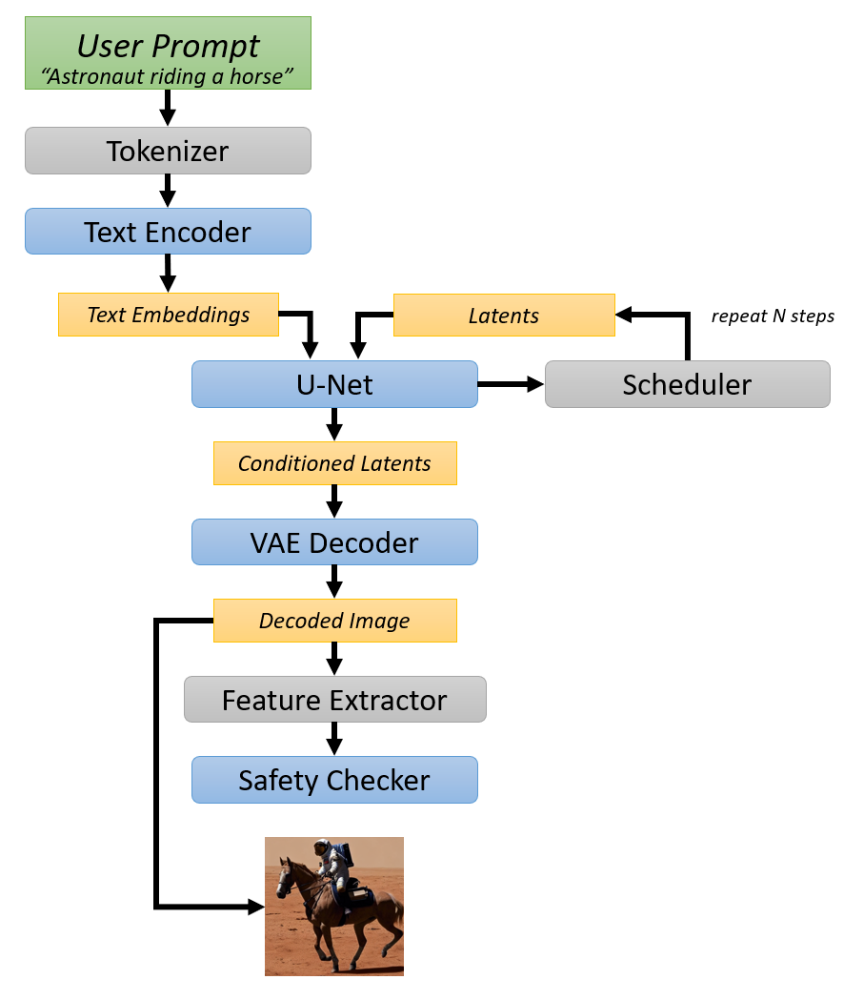

# Stable Diffusion XL Optimization with DirectML <!-- omit in toc -->

This sample shows how to optimize [Stable Diffusion XL Base](https://huggingface.co/stabilityai/stable-diffusion-xl-base-1.0) and [Stable Diffusion XL Refiner](https://huggingface.co/stabilityai/stable-diffusion-xl-refiner-1.0) to run with ONNX Runtime and DirectML.

Stable Diffusion XL comprises multiple PyTorch models tied together into a *pipeline*. This Olive sample will convert each PyTorch model to ONNX, and then run the converted ONNX models through the `OrtTransformersOptimization` pass. The transformer optimization pass performs several time-consuming graph transformations that make the models more efficient for inference at runtime. SDXL Base is guaranteed to be compatible with onnxruntime-directml 1.15.0 or newer, but SDXL Refiner is only guaranteed to be compatible with onnxruntime-directml 1.16.0 or newer.

**Contents**:
- [Setup](#setup)
- [Conversion to ONNX and Latency Optimization](#conversion-to-onnx-and-latency-optimization)
- [Test Inference](#test-inference)
- [Issues](#issues)
- [Stable Diffusion Pipeline](#stable-diffusion-pipeline)

# Setup

Olive is currently under pre-release, with constant updates and improvements to the functions and usage. This sample code will be frequently updated as Olive evolves, so it is important to install Olive from source when checking out this code from the main branch. See the [README for examples](https://github.com/microsoft/Olive/blob/main/examples/README.md#important) for detailed instructions on how to do this.

# Conversion to ONNX and Latency Optimization

The easiest way to optimize the pipeline is with the `stable_diffusion_xl.py` helper script. For SDXL Base, run the following:

```
python stable_diffusion_xl.py --model_id=stabilityai/stable-diffusion-xl-base-1.0 --optimize
```

For SDXL Refiner, run the following:

```
python stable_diffusion_xl.py --model_id=stabilityai/stable-diffusion-xl-refiner-1.0 --optimize
```

The above commands will enumerate the `config_<model_name>.json` files and optimize each one with Olive, then gather the optimized models into a directory structure suitable for testing inference.

The stable diffusion models are large, and the optimization process is resource intensive. It is recommended to run optimization on a system with a minimum of 16GB of memory (preferably 32GB). Expect optimization to take several minutes (especially the U-Net model).

Once the script successfully completes:
- The optimized ONNX pipeline will be stored under `models/optimized/[model_id]` (for example `models/optimized/stabilityai/stable-diffusion-xl-base-1.0`).
- The unoptimized ONNX pipeline (models converted to ONNX, but not run through transformer optimization pass) will be stored under `models/unoptimized/[model_id]` (for example `models/unoptimized/stabilityai/stable-diffusion-xl-base-1.0`).

Re-running the script with `--optimize` will delete the output models, but it will *not* delete the Olive cache. Subsequent runs will complete much faster since it will simply be copying previously optimized models; you may use the `--clean_cache` option to start from scratch (not typically used unless you are modifying the scripts, for example).

# Test Inference

This sample code is primarily intended to illustrate model optimization with Olive, but it also provides a simple interface for testing inference with the ONNX models. Inference is done by creating an `OnnxStableDiffusionPipeline` from the saved models, which leans on ONNX runtime for inference of the core models (text encoder, u-net and decoder).

Invoke the script with `--interactive` (and optionally `--num_images <count>`) to present a simple GUI where you may enter a prompt and generate images.

```
python stable_diffusion_xl.py --interactive --num_images 2
Loading models into ORT session...

Inference Batch Start (batch size = 1).
100%|███████████████████████████████████████████████| 51/51 [00:02<00:00, 23.93it/s]
Generated result_0.png
Inference Batch End.

Inference Batch Start (batch size = 1).
100%|███████████████████████████████████████████████| 51/51 [00:01<00:00, 26.22it/s]
Generated result_1.png
Inference Batch End.
```

Inference will loop until the generated image passes the safety checker (otherwise you would see black images). The result will be saved as `result_<i>.png` on disk, which is then loaded and displayed in the UI.

Run `python stable_diffusion_xl.py --help` for additional options. A few particularly relevant ones:
- `--model_id <string>` : name of a stable diffusion model ID hosted by huggingface.co. This script has been tested with the following:
  - `stabilityai/stable-diffusion-xl-base-1.0` (default)
- `--base_images <image_0.png> <image_1.png>` : specifies the base images to refine when running inference on the refiner model.
- `--num_inference_steps <int>` : the number of sampling steps per inference. The default value is 50. A lower value (e.g. 20) will speed up inference at the expensive of quality, and a higher value (e.g. 100) may produce higher quality images.
- `--num_images <int>` : the number of images to generate per script invocation (non-interactive UI) or per click of the generate button (interactive UI). The default value is 1.
- `--batch_size <int>` : the number of images to generate per inference (default of 1). It is typically more efficient to use a larger batch size when producing multiple images than generating a single image at a time; however, larger batches also consume more video memory.

If you omit `--interactive`, the script will generate the requested number of images without displaying a UI and then terminate. Use the `--prompt` option to specify the prompt when using non-interactive mode.

The minimum number of inferences will be `ceil(num_images / batch_size)`; additional inferences may be required of some outputs are flagged by the safety checker to ensure the desired number of outputs are produced.

# Issues

If you run into the following error while optimizing models, it is likely that your local HuggingFace cache has an incomplete copy of the stable diffusion model pipeline. Deleting `C:\users\<username>\.cache\huggingface` should resolve the issue by ensuring a fresh copy is downloaded.

```
OSError: Can't load tokenizer for 'C:\Users\<username>\.cache\huggingface\hub\models--stabilityai--stable-diffusion-xl-base-1.0\snapshots\<sha>'. If you were trying to load it from 'https://huggingface.co/models', make sure you don't have a local directory with the same name. Otherwise, make sure 'C:\Users\<username>\.cache\huggingface\hub\models--stabilityai--stable-diffusion-xl-base-1.0\snapshots\<sha>' is the correct path to a directory containing all relevant files for a CLIPTokenizer tokenizer.
```

# Stable Diffusion Pipeline

The figure below is a high-level overview of the Stable Diffusion pipeline, and is based on a figure from [Hugging Face Blog](https://huggingface.co/blog/stable_diffusion) that covers Stable Diffusion with Diffusers library. The blue boxes are the converted & optimized ONNX models. The gray boxes remain implemented by diffusers library when using this example for inference; a custom pipeline may implement the full pipeline without leveraging Python or the diffusers library.



The figure below shows the flow and relationship between the base and the refiner model, and is based on a figure from the [SDXL Refiner Hugging Face Repository](https://huggingface.co/stabilityai/stable-diffusion-xl-refiner-1.0).


