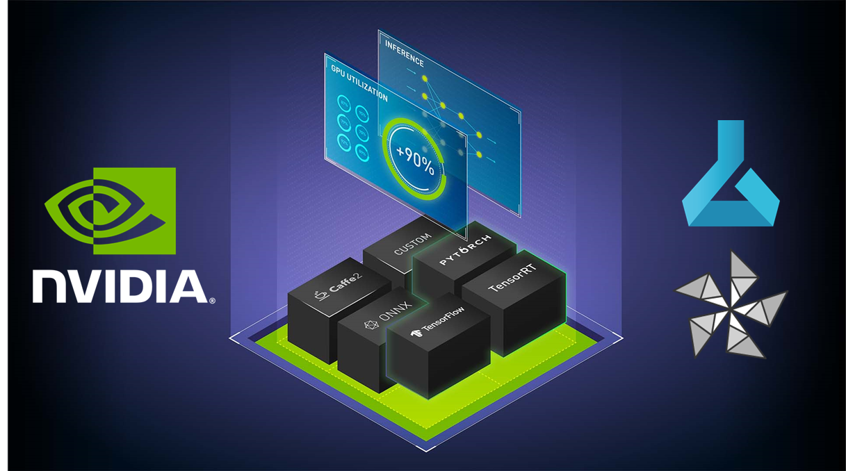
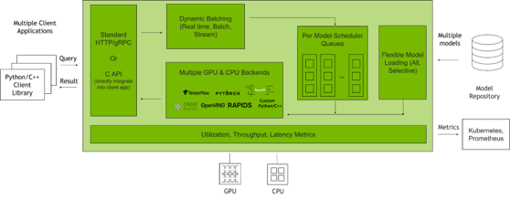
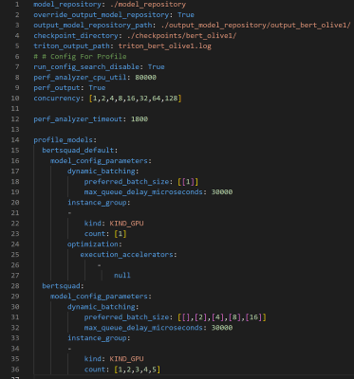
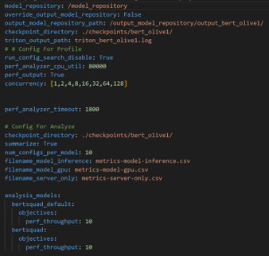
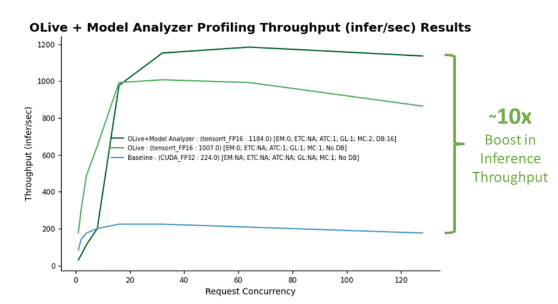
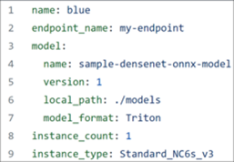
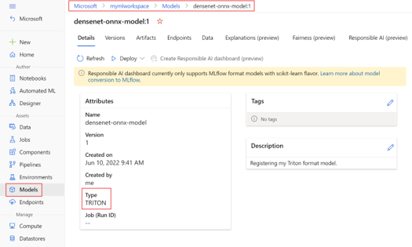

# Accelerate Model Inference for Azure ML Deployment with ONNX Runtime, OLive, NVIDIA Triton Inference Server, and Triton Model Analyzer

## Abstract

In this repo we show you how to achieve optimal inference performance on the deployment of your own models on an Azure Inference Endpoint using [ONNX Runtime](https://onnxruntime.ai/) and [OLive](https://github.com/microsoft/olive) (ONNX Runtime Go Live), [NVIDIA Triton Inference Server](https://developer.nvidia.com/nvidia-triton-inference-server) and its [Model Analyzer](https://github.com/triton-inference-server/model_analyzer). Using these tools, we will present optimized inference performance results with the following input parameters: the location and expected inputs and outputs shapes for a [Hugging Face]() Bert Model. By changing these parameters, you can boost inference performance on your own model.    

 
## AI Model Inference
 

 
Every AI application needs a strong inference engine. Whether you’re deploying an image recognition service, intelligent virtual assistant, or a fraud detection application, a reliable inference server delivers fast, accurate, and scalable predictions with low latency (low response time to a single query) and strong throughput (large number of queries processed in a given time interval). Yet, checking all these boxes can be difficult and expensive to achieve.   

Teams should consider deploying applications that can leverage:
Diverse frameworks with independent execution backends (e.g., ONNX Runtime, TensorFlow, PyTorch, etc.)
Different inference types (e.g., real-time, batch, streaming, etc.)
Disparate inference serving solutions for mixed infrastructure (e.g., CPU, GPU, etc.)
Different model configuration settings (e.g., dynamic batching, model concurrency, etc.) that can significantly impact inference performance.

These requirements can make AI inference an extremely challenging task. However, [NVIDIA Triton Inference Server](https://developer.nvidia.com/nvidia-triton-inference-server) makes this easy. 

In this repo, we explore how you can boost your AI inference performance on [Azure Machine Learning](https://azure.microsoft.com/en-us/services/machine-learning/) using the workflow shown in Figure 1. 

 

Figure 1.  
Workflow to optimize a PyTorch model using ONNX Runtime with OLive, Triton Model Analyzer, and AzureML
Alt Text: Workflow diagram illustrating the steps required to optimize a PyTorch model for inference: (1) Model conversion to ONNX format with OLive (2) ONNX Runtime parameter optimization with OLive (3) Triton parameter optimization with Model Analyzer (4) Azure Machine Learning Triton Inference Server deployment

Before we present our step-by-step tutorial, let us dive deeper into how exactly this workflow can support your AI inference performance.

## Machine learning model optimization workflow

To improve AI inference performance, both ONNX Runtime OLive and Triton Model Analyzer automate the parameter optimization steps prior to model deployment. In this post, we show how you can use these tools to optimize [ONNX Runtime’s parameters](https://onnxruntime.ai/docs/performance/tune-performance.html) such as execution provider, session options and precision parameters, along with [Triton’s parameters](https://github.com/triton-inference-server/server/blob/main/docs/model_configuration.md) such as dynamic batching and model concurrency parameters. 

### Phase 1: ONNX Runtime OLive optimizations

If Azure Machine Learning is where you deploy AI applications, you may be familiar with ONNX Runtime. ONNX Runtime is Microsoft’s high-performance inference engine to run AI models across platforms. It can deploy models across numerous configuration settings and is now supported in Triton. However, fine-tuning these parameters requires dedicated time and domain expertise. 

[OLive](https://github.com/microsoft/olive) (ONNX Runtime Go Live) is a Python package that speeds up this process by automating the work of accelerating models with ONNX Runtime. It offers two capabilities, converting models to ONNX format and auto tuning ONNX Runtime parameters to maximize inference performance. Running OLive will isolate and recommend ONNX Runtime configuration settings for the optimal core AI inference results. 

This post optimizes the ONNX Runtime BERT SQUAD model with OLive via the ONNX Runtime parameters:
* **Execution provider:** ONNX Runtime works with different hardware acceleration libraries through its extensible Execution Providers (EP) framework to optimally run the ONNX Runtime models on the hardware platform, which can optimize the execution by taking advantage of the platform’s compute capabilities. OLive explores optimization on following execution providers: MLAS (default CPU EP), Intel DNNL, and OpenVino for CPU, NVIDIA CUDA and TensorRT for GPU.
* **Session options:** OLive sweeps through ONNX Runtime session options to find the optimal configuration for thread control, which includes inter_op_num_threads, intra_op_num_threads, execution_mode, and graph_optimization_level.
* **Precision:** OLive evaluates performance with different precision, including float32 and float16, and returns the optimal precision configuration.

After running through the optimizations, you still may be leaving some performance on the table at application level. The end-to-end throughput and latency can be further improved using the Triton Model Analyzer, which is capable of supporting optimized ONNX Runtime models.  

### Phase 2: Triton Model Analyzer optimizations

Triton is an open-source inference serving software that helps standardize model deployment and execution and delivers fast and scalable AI inferencing in production. Figure 2 shows how the Triton Inference Server manages client requests when integrated with client applications and multiple AI models. 

 

Figure 2.  
Caption: Under the hood view of the Triton Inference Server managing client requests
Alt Text: Diagram depicting the inner workings of the Triton Inference Server interacting with client requests using standard HTTP / gRPC or C API. Then using Triton, an inference result is presented back to the client application using features such as Dynamic Batching and Model Concurrency.

Triton has many features, but today we will focus on optimizing two major ones with Triton Model Analyzer: 
Dynamic Batching: Triton enables inference requests to be combined by the server, so that a batch is created dynamically resulting in increased throughput within a fixed latency budget. 
Model Concurrency: Triton allows multiple models or instances of the same model to execute in parallel on the same system resulting in increased throughput.

These features are extremely powerful when deployed at optimal levels, however, when deployed with sub-optimal configurations, performance is left on the table leaving end-applications vulnerable to the demanding quality-of-service standards (latency, throughput, and memory requirements) of modern day applications. 

As a result, optimizing batch size and model concurrency levels based on expected user traffic is critical to unlock Triton’s full potential. These optimized [model configuration settings](https://github.com/triton-inference-server/server/blob/main/docs/model_configuration.md) will generate improved throughput under strict latency constraints, boosting GPU utilization when the application is deployed. This process can be automated using the Triton Model Analyzer.

Given a set of constraints such as latency constraints, throughput targets, or memory footprints, Triton Model Analyzer searches for and selects the best model configuration that maximizes inference performance based on different levels for batch size, model concurrency, or other Triton model configuration settings. When these features are deployed and optimized, customers see incredible results. 

## Tutorial: Begin optimizing inference performance

There are four steps to deploy optimized models with ONNX Runtime OLive and Triton Model Analyzer on AzureML:
 
* Launch an [Azure Virtual Machine](https://docs.microsoft.com/en-us/azure/virtual-machines/sizes-gpu) with NVIDIA’s GPU-optimized VMI
* Execute ONNX Runtime OLive and Triton Model Analyzer parameter optimizations on your model
* Analyze and customize the results
* Deploy the optimized Triton-ONNX Runtime model onto an AzureML endpoint 

To follow along, please ensure you have an Azure account with access to NVIDIA GPU-powered virtual machines. For example, use Azure [ND A100 v4-series](https://docs.microsoft.com/en-us/azure/virtual-machines/nda100-v4-series) VMs for [NVIDIA A100 GPUs](https://www.nvidia.com/en-us/data-center/a100/), [NCasT4 v3-series](https://docs.microsoft.com/en-us/azure/virtual-machines/nct4-v3-series) for [NVIDIA T4 GPUs](https://www.nvidia.com/en-us/data-center/tesla-t4/), or [NCv3-series](https://docs.microsoft.com/en-us/azure/virtual-machines/ncv3-series) for NVIDIA V100 GPUs. While we recommend the ND A100 v4-series for maximum performance at scale, this example uses a standard NC6s_v3 virtual machine using a single [NVIDIA V100 GPU](https://www.nvidia.com/en-us/data-center/v100/). 

### Step 1: Launching an Azure virtual machine with NVIDIA’s GPU-optimized VMI

In this tutorial, we use the [NVIDIA GPU-optimized VMI](https://azuremarketplace.microsoft.com/en-us/marketplace/apps/nvidia.ngc_azure_17_11?tab=overview) available on the Azure Marketplace. It is pre-configured with NVIDIA GPU drivers, CUDA, Docker toolkit, runtime and other dependencies. Additionally, it provides a standardized stack for developers to build their speech AI applications. 

To maximize performance, this VMI is validated and updated quarterly by NVIDIA with the newest drivers, security patches, and support for the latest GPUs.

For more details on how to launch and connect to the NVIDIA GPU-optimized VMI on your Azure VM, refer to this [in-depth documentation.](https://docs.nvidia.com/ngc/ngc-deploy-public-cloud/ngc-azure/index.html#abstract) 

### Step 2: Executing ONNX Runtime OLive and Triton Model Analyzer optimizations 

Once you have connected to your Azure VM via SSH with the NVIDIA GPU-optimized VMI loaded, you are ready to begin executing ONNX Runtime OLive and Triton Model Analyzer optimizations. 

First, clone the GitHub Repository and navigate to the content root directory by running the following commands: 

**‘git clone https://github.com/microsoft/OLive.git’**

**‘cd olive-model_analyzer-azureML’**

Next, load the [Triton Server container.](https://catalog.ngc.nvidia.com/orgs/nvidia/containers/tritonserver) Note that this guide uses the version number 22.06.

**‘docker run --gpus=1 --rm -it -v “$(pwd)”:/models nvcr.io/nvidia/tritonserver:22.06-py3 /bin/bash’** 

Once loaded, navigate to the ‘/models’ folder where the GitHub material was mounted:
 
**‘cd /models’** 

To get started, first download the OLive and ONNX Runtime packages, along with the model you want to optimize. Then, specify the location of the model you want to optimize by setting up the following environmental variables:

* **export model_location**=https://olivewheels.azureedge.net/oaas/bert-base-cased-squad.pth

* **export model_filename**=bert-base-cased-squad.pth

You may adjust the above location and filename with a model of your choice. For optimal performance, we recommend downloading certified pre-trained models directly from the NGC catalog, which are trained to high accuracy and are available with high-level credentials and code samples.

Next, run the script:

**‘bash download.sh $model_location $model_filename’** 

The script will download three files onto your machine: 

* OLive package: ‘onnxruntime_olive-0.3.0-py3-none-any.whl’
* ONNX Runtime package: ‘onnxruntime_gpu_tensorrt-1.9.0-cp38-cp38-linux_x86_64.whl’
* PyTorch Model: ‘bert-base-cased-squad.pth’

Before running the pipeline in Figure 1, first specify its input parameters by setting up environmental variables: 
 
* **export model_name=bertsquad**
* **export model_type=pytorch**
* **export in_names=input_names,input_mask,segment_ids**
* **export in_shapes=[[-1,256],[-1,256],[-1,256]]**
* **export in_types=int64,int64,int64**
* **export out_names=start,end**

The parameters ‘In_names’, ‘in_shapes’,and ‘in_types’, refer to the names, shapes and types of the expected inputs for the model. In this case, inputs are sequences of length 256, however they are specified as [-1,256] to allow the batching of inputs. You can change the parameters values that correspond to your model and its expected inputs and outputs.

Now, we’re ready to run the pipeline by executing the following command: 

**‘bash optimize.sh $model_filename $model_name $model_type  $in_names $in_shapes $in_types $out_names’**

Under the hood, the above command first installs all necessary libraries and dependencies, and calls on OLive to convert the original model into an ONNX format. Next, Model Analyzer is called to automatically generate the model’s configuration file with the model’s meta data. The configuration file is then passed back into OLive to optimize via the ONNX Runtime parameters discussed earlier (execution provider, session options, and precision). 

To further boost throughput and latency, the ONNX Runtime-optimized model configuration file is then passed into the Triton model repository for use by the Triton Model Analyzer tool. Model Analyzer then runs the [‘profile’ command](https://github.com/triton-inference-server/model_analyzer/blob/main/docs/config.md#config-options-for-profile), which sets up the optimization search space and specifies the location of the Triton Model repository using a .yaml configuration file (see Figure 3). 

 

Figure 3.  
Caption: Profile configuration file outlining Model Analyzer’s search space to optimize inference performance
Alt Text: Profile configuration file with details around the location of the Model Repository, parameters to optimize, and their ranges to create the search space used by Model Analyzer to find the optimal configuration settings. 

The configuration file above can be used to customize the search space for Triton Model Analyzer in a number of ways. The file requires the location of the Model Repository, parameters to optimize, and their ranges to create the search space used by Model Analyzer to find the optimal configuration settings. 

* Lines 1-5 specify important paths such as the location of the Output Model Repository where the optimized models are placed
* Line 10 specifies the parameter concurrency which dictates the concurrent inference request levels to be used by the [Perf Analyzer](https://github.com/triton-inference-server/server/blob/main/docs/perf_analyzer.md), which emulates user traffic.
* Line 15 specifies the ‘bert_default’ model, which corresponds to the default model obtained from the PyTorch to ONNX conversion. This model is the baseline model and therefore uses non-optimized values for dynamic batching (line 17) and model concurrency (line 20) 
* Lines 19 and 32 shows a latency constraint of 30ms that must be satisfied during the optimization process 
* Line 28 specifies the ‘bertsquad’ model, which corresponds to the OLive optimized model. This one differs from the ‘bert_default’ model because the dynamic batching parameter search space here is set to 1, 2, 4, 8 and 16, and the model concurrency parameter search space is set to 1, 2, 3, 4 and 5. 

The ‘profile’ command records results across each concurrent inference request level, and for each concurrent inference request level, the results are recorded for 25 different parameters since the search space for both the dynamic batching and model concurrency parameters have five unique values each, equating to a total of 25 different parameters. Note that the time needed to run this will scale with the number of configurations provided in the search space within the profile configuration file in Figure 3. 

The script then runs the Model Analyzer [‘analyze’ command](https://github.com/triton-inference-server/model_analyzer/blob/main/docs/config.md#config-options-for-analyze) to process the results using an additional configuration file shown in Figure 4. The file specifies the location of the output model repository where the results were generated from the ‘profile’ command, along with the name of the CSV files where the performance results will be recorded. 

 

Figure 4.  
Caption: Analyze configuration file used to run the ‘analyze’ and process the results from the ‘profile’ command
Alt Text: Analyze configuration file with details around the location of the output model repository where the results were generated from the ‘profile’ command, along with the name of the CSV files where the performance results will be recorded. 

While the ‘profile’ and ‘analyze’ commands may take a couple of hours to run, the optimized model configuration settings will ensure strong long-term inference performance for your deployed model. For shorter run times, we recommend adjusting the model profile configuration file (Figure 3) with a smaller search space across the parameters you wish to optimize.

Once the demo completes running, there should be two files produced: ‘Optimal_Results.png’ as seen in Figure 5, and ‘Optimal_ConfigFile_Location.txt’, which represents the location of the optimal config file to be deployed on AzureML. 

### Step 3: Analyzing and customizing performance results

 

Figure 5.  
Caption: 10x boost in inference throughput when applying OLive + Model Analyzer optimized configuration settings on an Azure virtual machine (Standard_NC6s_v3) using a single V100 NVIDIA GPU. EM represents execution mode, ETC & ATC represents inter op and intra op thread counts, GL represents graph optimization level, MC represents model concurrency, and DB represents dynamic batching (Note: This is not an official benchmark).

Alt Text: Chart depicting the 10x boost in inference throughput when using OLive and Model Analyzer optimized configuration settings on an Azure virtual machine (Standard_NC6s_v3) using a single V100 NVIDIA GPU. The x-axis represents the inference request concurrency, while the y-axis represents the throughput observed. This is shown using a non-optimized baseline (blue line - CUDA execution provider and FP32 precision), OLive optimized model (light green line - TensorRT execution provider, FP16 precision, 1 intra op thread count, 1 graph optimization level, and 1 model concurrency), and OLive and Model Analyzer optimized model (dark green line - TensorRT execution provider, FP16 precision, 1 intra op thread count, 1 graph optimization level, 2 model concurrency and 16 dynamic batching)

Figure 5 establishes a no optimization baseline (blue) and shows the performance boost achieved through OLive optimizations (light green), and OLive + Model Analyzer optimizations (dark green). 

The baseline corresponds to a model with non-optimized ONNX Runtime parameters (CUDA backend with full precision) and non-optimized default Triton parameters (no dynamic batching nor model concurrency). With the baseline established, it is clear there is a big boost in inference throughput performance (Y-Axis) obtained from both OLive and Triton Model Analyzer optimizations at various inference request concurrency levels (X-Axis) emulated by [Triton Perf Analyzer](https://github.com/triton-inference-server/server/blob/main/docs/perf_analyzer.md), a tool that mimics user traffic by generating inference requests. 

From the graph in Figure 5, we see that the OLive optimizations improved model performance (light green line) by tuning the execution provider to TensorRT with mixed precision, along with other ONNX Runtime parameters. However, this shows performance without Triton dynamic batching nor model concurrency and therefore this model can be further optimized with Triton Model Analyzer.

Triton Model Analyzer further boosts inference performance by 20% (dark green line) after optimizing model concurrency and dynamic batching. The final optimal values selected by Triton Model Analyzer are a model concurrency of 2 (i.e., two copies of the BERT model will be saved on the GPU) and a max dynamic batching level of 16 (i.e., up to 16 inference requests will be batched together at one time). 

Overall, the gain on inference performance using optimized parameters is over 10-fold! 

Additionally, if you are expecting certain levels of inference requests for your application, you may [adjust the emulated user traffic](https://github.com/triton-inference-server/client/blob/main/src/c%2B%2B/perf_analyzer/perf_analyzer.cc#L93) by configuring the Triton Perf Analyzer. You may also adjust the model configuration file to include [additional parameters to optimize](https://github.com/triton-inference-server/model_analyzer/blob/main/docs/config_search.md#manual-configuration-search) such as ‘Delayed Batching’.
 
### Step 4: Deploying the optimized model onto an AzureML endpoint 

Deploying your optimized AI model for inference on [Azure Machine Learning with Triton](https://docs.microsoft.com/en-us/azure/machine-learning/how-to-deploy-with-triton?tabs=endpoint) is as simple as using a [managed online endpoint](https://docs.microsoft.com/en-us/azure/machine-learning/concept-endpoints#managed-online-endpoints) with [Azure Machine Learning Studio](https://ml.azure.com/)’s no code interface. 

Managed online endpoints help you deploy ML models in a turnkey manner. It takes care of serving, scaling, securing, and monitoring your models freeing you from the overhead of setting up and managing the underlying infrastructure. In order to continue, ensure you have downloaded the [Azure CLI](https://docs.microsoft.com/en-us/cli/azure/), and have the YAML file as seen in Figure 6 handy. 

 

Figure 6.  
Caption: YAML file for the optimized BERT model 
Alt Text: Screenshot of the YAML file for the optimized BERT model. It shows the name, endpoint name, model name, model version, model path, model format, instance count and instance type.

First, [register your model](https://docs.microsoft.com/en-us/azure/machine-learning/how-to-manage-models?tabs=use-local#register-your-model-as-an-asset-in-machine-learning-by-using-the-ui) in Triton format using the above YAML fi le. Your registered model should look similar to Figure 7 as shown in the ‘Models’ page of AzureML Studio. 

 

Figure 7.  
Caption: AzureML Studio registered optimized model

Now, select the Triton model, select ‘Deploy’, and then hit ‘Deploy to real-time endpoint’. Continue through the wizard to deploy the ONNX Runtime and Triton optimized model to the endpoint. Note that no scoring script is required when you deploy a Triton model to an AzureML managed endpoint.

Congratulations! 

You have now deployed a BERT SQUAD model optimized for inference performance using ONNX Runtime and Triton parameters on AzureML. By optimizing these parameters, you have unlocked a 10x fold increase in performance relative to the non-optimized baseline BERT SQUAD model. 

## Resources for exploring machine learning model inference tools

There are several resources designed to help you learn how to deploy AI applications with NVIDIA Triton, ONNX Runtime, and Azure Machine Learning. 

### Triton
* Download NVIDIA Triton today as a [Docker container from NGC](https://catalog.ngc.nvidia.com/orgs/nvidia/containers/tritonserver)
* [Get started](https://developer.nvidia.com/triton-inference-server/get-started#resources) with everything you need for Triton, including tutorials, notebooks, and documentation
* Explore our [Triton](https://github.com/triton-inference-server/server/blob/main/docs/model_configuration.md) and [Model Analyzer](https://github.com/triton-inference-server/model_analyzer) GitHub repositories, along with our [technical blogs](https://developer.nvidia.com/blog/tag/triton/) and [technical overview](https://resources.nvidia.com/en-us-triton-inference-server/triton-technical-overview) to dive deeper into what Triton has to offer and how it works
* Learn how to [deploy models to NVIDIA Triton on Azure Machine Learning](https://www.nvidia.com/en-us/on-demand/session/gtcfall21-a31673/?playlistId=playList-ead11304-9931-4e91-9d5a-fb0e1ef27014)
* Watch Triton-specific [GTC sessions on-demand](https://www.nvidia.com/en-us/on-demand/playlist/playList-8a0aa50c-79b8-4c21-9c31-8857cb1dbc88/)
* Deploy Triton at scale with [Multi-Instance GPUs and Kubernetes](https://developer.nvidia.com/blog/deploying-nvidia-triton-at-scale-with-mig-and-kubernetes/) 

Interested in learning about how customers deploy AI applications in production with NVIDIA Triton? Explore other real-world applications and learn how [Siemens Energy](https://blogs.nvidia.com/blog/2021/11/09/siemens-energy-taps-nvidia-triton-inference-server-for-power-plant-inspections-autonomy/) and [American Express](https://blogs.nvidia.com/blog/2020/10/05/american-express-nvidia-ai/) have accelerated AI inference workflows with Triton. See how your company can get started with Triton through [NVIDIA AI Enterprise](https://developer.nvidia.com/triton-inference-server/get-started#ai-enterprise) and [NVIDIA LaunchPad.](https://developer.nvidia.com/triton-inference-server/get-started#launchpad) 

### ONNX Runtime & Azure Machine Learning
* Deploy machine learning models with [AzureML’s managed online endpoints](https://docs.microsoft.com/en-us/azure/machine-learning/how-to-deploy-managed-online-endpoints)
* Understand the fundamentals of [deploying real-time machine learning services on AzureML](https://docs.microsoft.com/en-us/learn/modules/register-and-deploy-model-with-amls/) 
* Learn more about the journey to [optimize large scale transformer model inferences with ONNX Runtime](https://cloudblogs.microsoft.com/opensource/2021/06/30/journey-to-optimize-large-scale-transformer-model-inference-with-onnx-runtime/)
* Optimize and deploy [transformer INT8 inference with ONNX Runtime-TensorRT on NVIDIA GPUs](https://cloudblogs.microsoft.com/opensource/2022/05/02/optimizing-and-deploying-transformer-int8-inference-with-onnx-runtime-tensorrt-on-nvidia-gpus/)
* Explore how to [run and deploy machine learning models on the web with ORT Web](https://cloudblogs.microsoft.com/opensource/2021/09/02/onnx-runtime-web-running-your-machine-learning-model-in-browser/)

To learn more about how customers deploy AI applications, explore how Microsoft’s [Bing has improved BERT inference on NVIDIA GPUs](https://azure.microsoft.com/en-us/blog/bing-delivers-its-largest-improvement-in-search-experience-using-azure-gpus/) for its real-time service needs, serving more than one million BERT inferences per second. 

