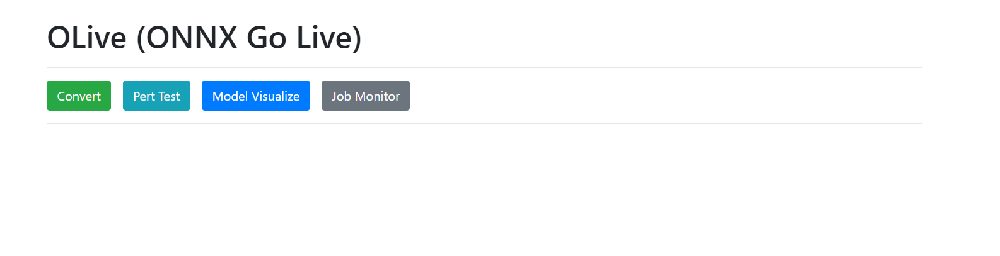
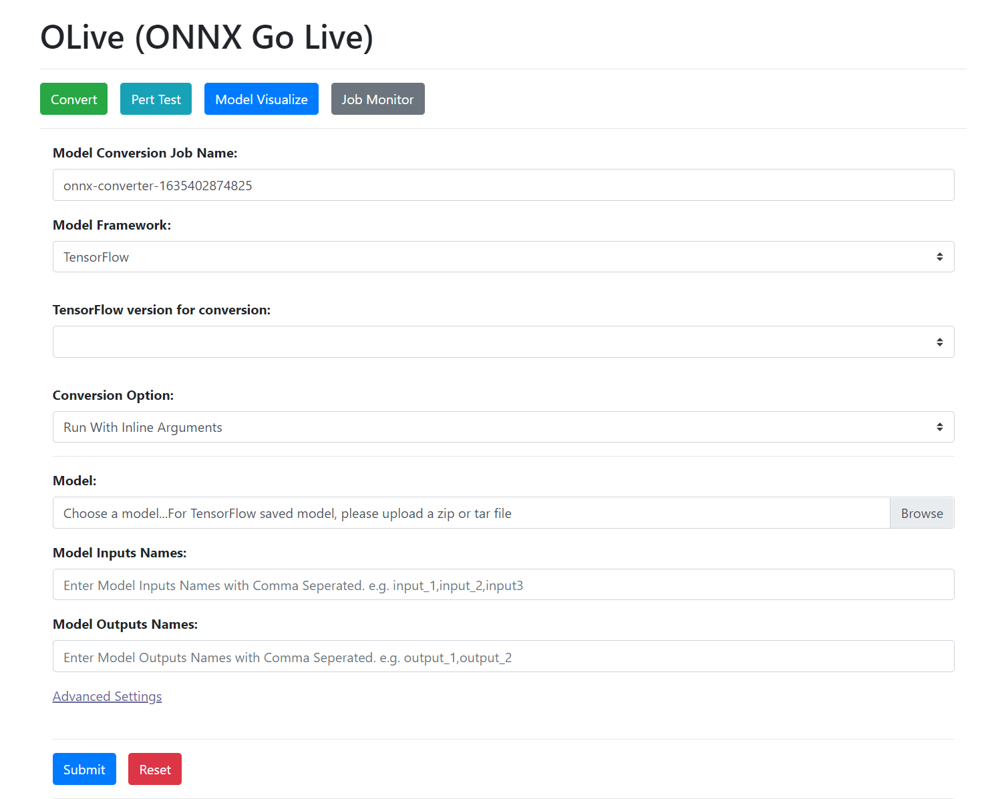
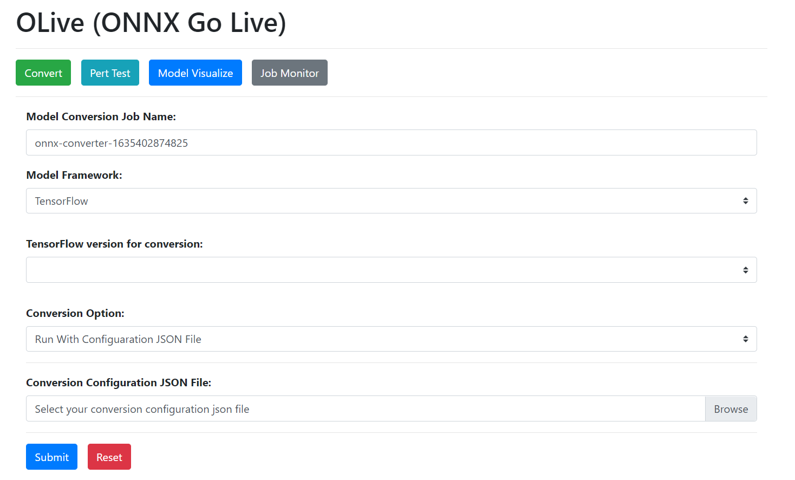
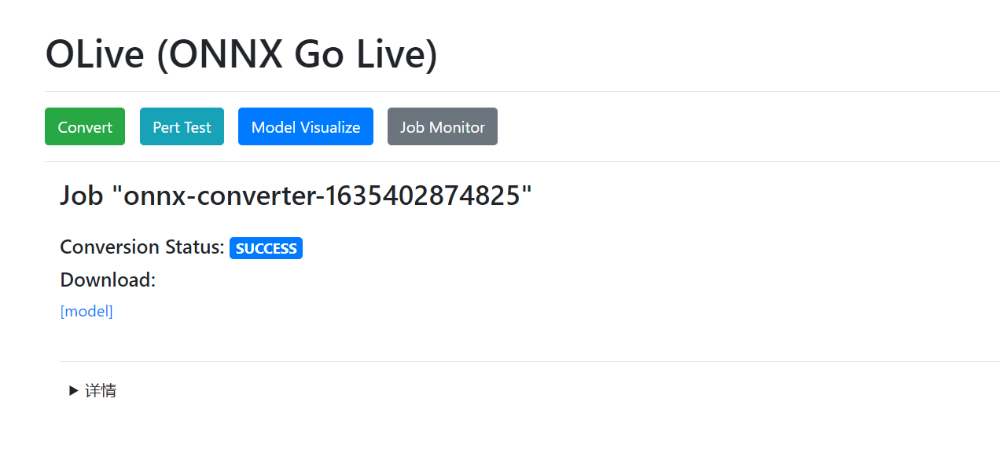
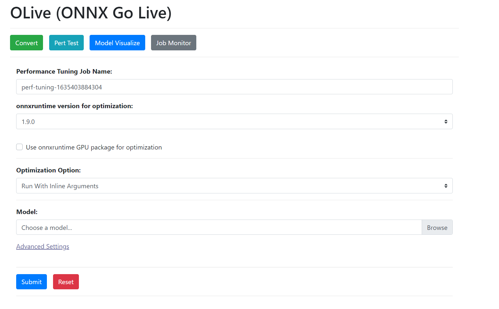
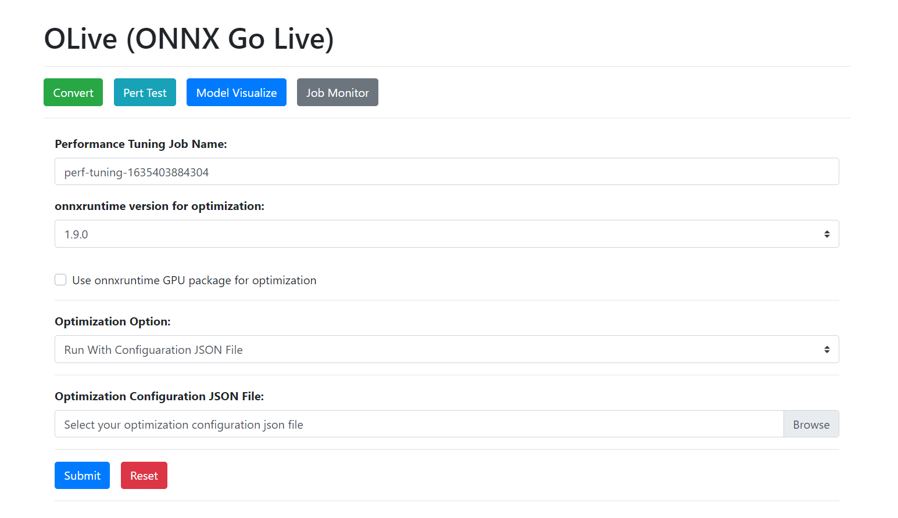
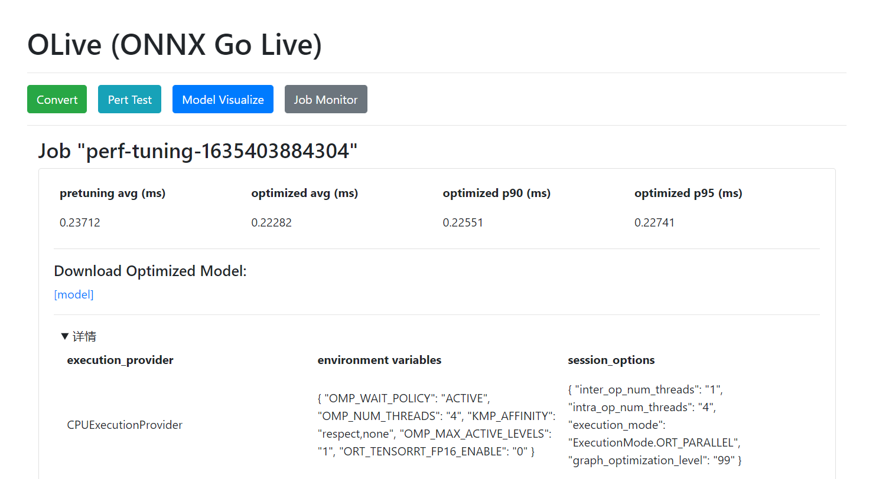
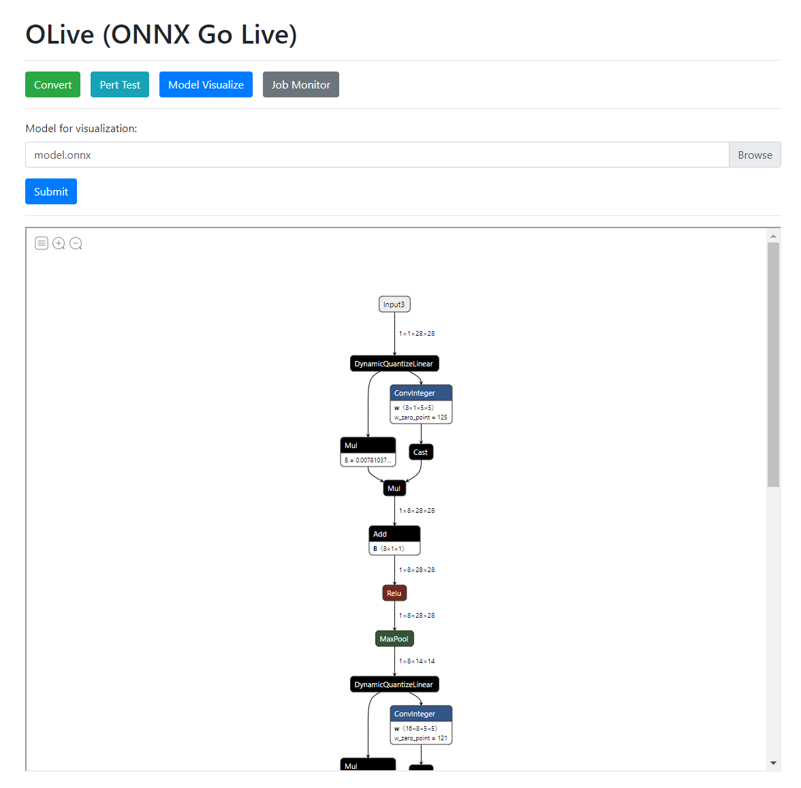
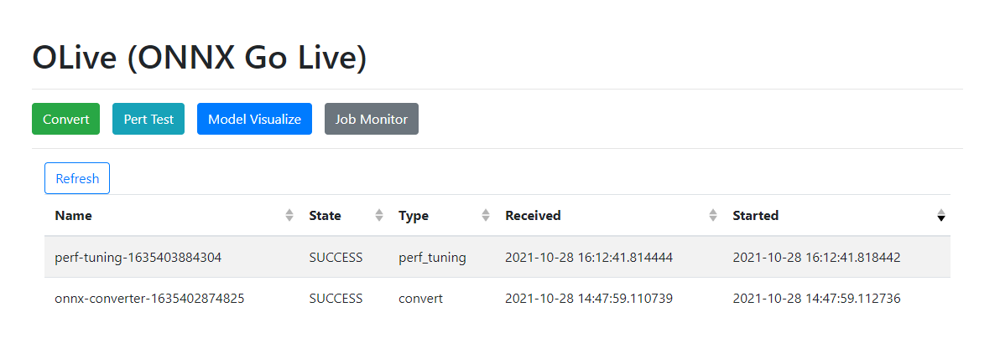

# OLive Server

This repository shows how to setup OLive server to run model conversion, optimizaton, and visualization service.

## Prerequisites
User needs to install [Dokcer](https://docs.docker.com/get-docker/) to setup OLive server.

Download OLive pakcage [here](https://olivewheels.blob.core.windows.net/repo/onnxruntime_olive-0.3.0-py3-none-any.whl) and install with command `pip install onnxruntime_olive-0.3.0-py3-none-any.whl`

Call `olive setup --server` to install required packages first.

## How to use

User can call `olive server` to start OLive server. 

### Convert Page
Converts models from PyTorch and TensorFlow model frameworks to ONNX, and tests the converted models' correctness.

In OLive Server Convert page, user can run server with inline arguments, 

or run server with configuration JSON file. 

Here are settings for OLive Conversion:

| settings | Detail |
|:--|:--|
| **Model Framework** | model original framework |
| **Framework Version for Conversion** | original framework version |
| **Conversion Option** | run service with configuration JSON file or inline arguments |
| **Conversion Configuration JSON File** | upload configuration JSON file |
| **Model** | upload model for conversion |
| **Model Inputs Names** | comma-separated list of names of input nodes of model |
| **Model Outputs Names** | comma-separated list of names of output nodes of model |
| **Model Inputs Shapes** | list of shapes of each input node. The order of the input shapes should be the same as the order of input names |
| **Model Outputs Shapes** | list of shapes of each output node. The order of the output shapes should be the same as the order of output names |
| **Model Inputs Types** | comma-separated list of types of input nodes. The order of the input types should be the same as the order of input names |
| **Model Outputs Types** | comma-separated list of types of output nodes. The order of the output types should be the same as the order of output names |
| **Model Sample Input Data (.npz file)** | upload sample input data |
| **ONNX Target Opset** | target opset version for conversion |

User can submit job and check job result with link appears at the end of page. 

In the conversion job result page, user can check conversion status and download converted ONNX model. 

### Perf Test Page
Tunes different execution providers, inference session options, and environment variable options for the ONNX model with ONNX Runtime. Selects and outputs the option combinations with the best performance.

In OLive Server Perf Test page, user can run server with inline arguments, 

or run server with configuration JSON file. 

Here are settings for OLive Optimization:

| settings | Detail |
|:--|:--|
| **onnxruntime version for optimization** | onnxruntime version used for model optimization |
| **Use onnxruntime GPU package for optimization** | model optimization with GPU enabled or not |
| **Optimization Option** | run service with configuration JSON file or inline arguments |
| **Optimization Configuration JSON File** | upload configuration JSON file for optimization |
| **Model** | upload model for optimization |
| **Model Inputs Names** | comma-separated list of names of input nodes of model |
| **Model Output Names** | comma-separated list of names of input nodes of model |
| **Model Inputs Shapes** | list of shapes of each input node. The order of the input shapes should be the same as the order of input names |
| **Model Sample Input Data Path** | upload sample input data |
| **Execution Providers** | providers used for perftuning |
| **TensorRT FP16 mode optimization** | whether enable fp16 mode for TensorRT or not|
| **Quantization Optimization** | whether enable quantization optimization or not |
| **Transformer Optimization** | whether enable transformer optimization or not |
| **Transformer Arguments** | onnxruntime transformer optimizer args |
| **Execution Modes** | execution modes for perftuning |
| **Number of Intra Threads** | list of intra thread number for perftuning |
| **Number of Inter Threads** | list of inter thread number for perftuning |
| **OMP_MAX_ACTIVE_LEVELS** | maximum number of nested active parallel regions |
| **OMP WAIT POLICY** | OpenMP wait policy for perftuning |
| **Optimization Level** | onnxruntime optimization level |
| **Number of Concurrency** | tuning process concurrency number |
| **Repeated times for test** | repeat test times for latency measurement |
| **Repeated times for warmup** | warmup times for latency measurement |

User can submit job and check job result with link appears at the end of page. 

In the optimization job result page, user can compare pre-tuning latency and optimal latency, download optimized ONNX model, and check session options and environment variables for onnxruntime inference. 

### Model Visualize Page
User can upload models and get more model details with this page.

### Job Monitor Page
User can check all optimization and conversion jobs in this page.

## How to stop
User can simplely stop OLive server with ctrl+c
